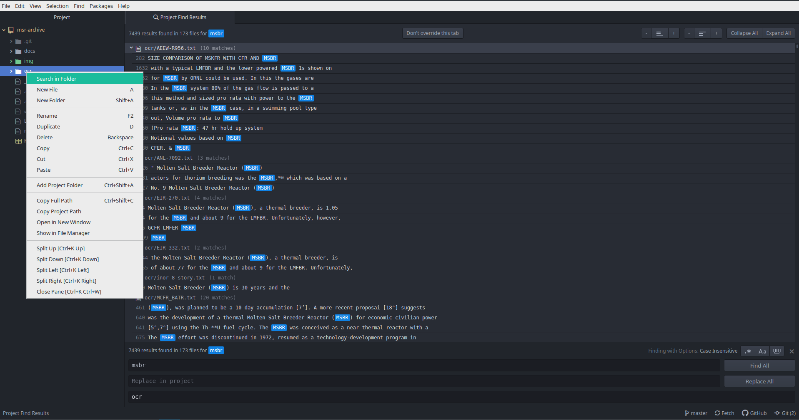

# **msr-archive**
> curated documents pertaining to early molten salt reactor research.

[<kbd> download all files </kbd>](https://github.com/openmsr/msr-archive/archive/refs/heads/master.zip)

---

poor text formatting in many of the publically available pdf scans of documents pertaining to early molten salt reactors make it cumbersome to sift out specific details.
this repository is intending to make a searchable archive of ocr text files of documents pertaining to molten salt reactors, the need of which stem from the [msre cad file project](https://github.com/openmsr/msre).

documents are rescanned with optical character recognition (ocr) using [ocrmypdf](https://github.com/jbarlow83/OCRmyPDF), [tesseract](https://github.com/tesseract-ocr/tesseract), and training set '[eng.traineddata](https://github.com/tesseract-ocr/tessdata)'.

disclaimer: this repository is **not** intended to be a distribution of pdf documents, or an infringement on any possible copyright claims. for the original documents we refer to other sites, such as ornl's [library catalog](https://libcat.ornl.gov/) or [energyfromthorium](http://energyfromthorium.com/pdf/).

this repo uses [git mlfs (git large file storage)](https://git-lfs.github.com/) to manage version history of pdf's. so to clone this repo with the pdf's to your system you'll  need to install git and git-lfs.

to search the repository for a keyword or phase it's recommended to use the [atom editor](https://atom.io/)'s 'search in folder' function on the '/ocr' folder as is demonstrated here for the keyword 'msbr'

using the plus and minus buttons at the top the context can be expanded or contracted. the individual pdf documents of interest in the '/docs' folder can then be opened with a pdf viewer.
this method can be used to find documents with relevant information. be aware that the ocr is not great and there can be issues with missing spaces and wrong identification of letters and numbers, e.g. 'l00p' instead of 'loop'.

---

## index

  - [Nuclear Science and Engineering](#nse)
  - [Fluid Fuel Reactors](#ffr)
    - [Part I: Aqueous Homogeneous Reactors](#part-i)
    - [Part II: Molten-Salt Reactors](#part-ii)
    - [Part III: Liquid Metal Fuel Reactors](#part-iii)
  - [Nuclear Applications and Technology](#nat)
    - [volume 8](#vol-8)
    - [volume 10](#vol-10)
  - [ORNL Reports Related to Liquid-Fluoride Reactors and Technology](#ornl)
  - [ORNL Technical Memoranda Related to the Molten-Salt Reactor Program](#ornl-tm)
  - [ORNL Central Files Related to the Molten-Salt Reactor Program](#ornl-cf)
  - [Liquid-Chloride Reactors](#lcr)
  - [EIP Documents](#eip)
  - [Assorted Documents](#assorted)
  - [New Piles Commitee Documents](#newpiles)
---

### Nuclear Science and Engineering, **2** 2 (February 1957). 
| article | filename | ocr |
|:--------|:--------:|:------:|
| [Molten Fluorides as Power Reactor Fuels](https://media.githubusercontent.com/media/openmsr/msr-archive/master/docs/NSE_moltenFluorides.pdf) | NSE_moltenFluorides  | [txt](ocr/NSE_moltenFluorides.txt) |
| [The Aircraft Reactor Experiment--Design and Construction](https://media.githubusercontent.com/media/openmsr/msr-archive/master/docs/NSE_ARE_Design.pdf) | NSE_ARE_Design | [txt](ocr/NSE_ARE_Design.txt) |
| [The Aircraft Reactor Experiment--Physics](https://media.githubusercontent.com/media/openmsr/msr-archive/master/docs/NSE_ARE_Physics.pdf) | NSE_ARE_Physics  | [txt](ocr/NSE_ARE_Physics.txt) |
| [The Aircraft Reactor Experiment--Operation](https://media.githubusercontent.com/media/openmsr/msr-archive/master/docs/SE_ARE_Operation.pdf) | SE_ARE_Operation | [txt](ocr/SE_ARE_Operation.txt) |

---

### Fluid Fuel Reactors, Addison-Wesley (1958). 
| part | filename | ocr |
|:--------|:--------:|:------:|
| [Part I: Aqueous Homogeneous Reactors](https://media.githubusercontent.com/media/openmsr/msr-archive/master/docs/FFR_part1.pdf) | FFR_part1 | [txt](ocr/FFR_part1.txt) |
| [Part II: Molten-Salt Reactors](https://media.githubusercontent.com/media/openmsr/msr-archive/master/docs/FFR_part2.pdf) | FFR_part2 | [txt](ocr/FFR_part2.txt) |
| [Part III: Liquid Metal Fuel Reactors](https://media.githubusercontent.com/media/openmsr/msr-archive/master/docs/FFR_part3.pdf) | FFR_part3 | [txt](ocr/FFR_part3.txt) |

#### Part I: Aqueous Homogeneous Reactors 
| chapter | filename | ocr |
|:--------|:--------:|:------:|
| [Chapter 1: Homogeneous Reactors and their Development](https://media.githubusercontent.com/media/openmsr/msr-archive/master/docs/FFR_chap01.pdf) | FFR_chap01 | [txt](ocr/FFR_chap01.txt) |
| [Chapter 2: Nuclear Characteristics of One- and Two-Region Homogeneous Reactors](https://media.githubusercontent.com/media/openmsr/msr-archive/master/docs/FFR_chap02.pdf) | FFR_chap02 | [txt](ocr/FFR_chap02.txt) |
| [Chapter 3: Properties of Aqueous Fuel Solutions](https://media.githubusercontent.com/media/openmsr/msr-archive/master/docs/FFR_chap03.pdf) | FFR_chap03 | [txt](ocr/FFR_chap03.txt) |
| [Chapter 4: Technology of Aqueous Suspensions](https://media.githubusercontent.com/media/openmsr/msr-archive/master/docs/FFR_chap04.pdf) | FFR_chap04 | [txt](ocr/FFR_chap04.txt) |
| [Chapter 5: Integrity of Metals in Homogeneous Reactor Media](https://media.githubusercontent.com/media/openmsr/msr-archive/master/docs/FFR_chap05.pdf) | FFR_chap05 | [txt](ocr/FFR_chap05.txt) |
| [Chapter 6: Chemical Processing](https://media.githubusercontent.com/media/openmsr/msr-archive/master/docs/FFR_chap06.pdf) | FFR_chap06 | [txt](ocr/FFR_chap06.txt) |
| [Chapter 7: Design and Construction of Experimental Homogeneous Reactors](https://media.githubusercontent.com/media/openmsr/msr-archive/master/docs/FFR_chap07.pdf) | FFR_chap07 | [txt](ocr/FFR_chap07.txt) |
| [Chapter 8: Component Development](https://media.githubusercontent.com/media/openmsr/msr-archive/master/docs/FFR_chap08.pdf) | FFR_chap08 | [txt](ocr/FFR_chap08.txt) |
| [Chapter 9: Large-Scale Homogeneous Reactor Studies](https://media.githubusercontent.com/media/openmsr/msr-archive/master/docs/FFR_chap09.pdf) | FFR_chap09 | [txt](ocr/FFR_chap09.txt) |
| [Chapter 10: Homogeneous Reactor Cost Studies](https://media.githubusercontent.com/media/openmsr/msr-archive/master/docs/FFR_chap10.pdf) | FFR_chap10 | [txt](ocr/FFR_chap10.txt) |

#### Part II: Molten-Salt Reactors 
| chapter | filename | ocr |
|:--------|:--------:|:------:|
| [Chapter 11: Introduction](https://media.githubusercontent.com/media/openmsr/msr-archive/master/docs/FFR_chap11.pdf) | FFR_chap11 | [txt](ocr/FFR_chap11.txt) |
| [Chapter 12: Chemical Aspects of Molten Fluoride Salt Reactor Fuels](https://media.githubusercontent.com/media/openmsr/msr-archive/master/docs/FFR_chap12.pdf) | FFR_chap12 | [txt](ocr/FFR_chap12.txt) |
| [Chapter 13: Construction Materials for Molten-Salt Reactors](https://media.githubusercontent.com/media/openmsr/msr-archive/master/docs/FFR_chap13.pdf) | FFR_chap13 | [txt](ocr/FFR_chap13.txt) |
| [Chapter 14: Nuclear Aspects of Molten-Salt Reactors](https://media.githubusercontent.com/media/openmsr/msr-archive/master/docs/FFR_chap14.pdf) | FFR_chap14 | [txt](ocr/FFR_chap14.txt) |
| [Chapter 15: Equipment for Molten-Salt Reactors Heat-Transfer Systems](https://media.githubusercontent.com/media/openmsr/msr-archive/master/docs/FFR_chap15.pdf) | FFR_chap15 | [txt](ocr/FFR_chap15.txt) |
| [Chapter 16: Aircraft Reactor Experiment](https://media.githubusercontent.com/media/openmsr/msr-archive/master/docs/FFR_chap16.pdf) | FFR_chap16 | [txt](ocr/FFR_chap16.txt) |
| [Chapter 17: Conceptual Design of a Power Reactor](https://media.githubusercontent.com/media/openmsr/msr-archive/master/docs/FFR_chap17.pdf) | FFR_chap17 | [txt](ocr/FFR_chap17.txt) |

#### Part III: Liquid Metal Fuel Reactors 
| chapter | filename | ocr |
|:--------|:--------:|:------:|
| [Chapter 18: Liquid Metal Fuel Reactors](https://media.githubusercontent.com/media/openmsr/msr-archive/master/docs/FFR_chap18.pdf) | FFR_chap18 | [txt](ocr/FFR_chap18.txt) |
| [Chapter 19: Reactor Physics for Liquid Metal Reactors Design](https://media.githubusercontent.com/media/openmsr/msr-archive/master/docs/FFR_chap19.pdf) | FFR_chap19 | [txt](ocr/FFR_chap19.txt) |
| [Chapter 20: Composition and Properties of Liquid Metal Fuels](https://media.githubusercontent.com/media/openmsr/msr-archive/master/docs/FFR_chap20.pdf) | FFR_chap20 | [txt](ocr/FFR_chap20.txt) |
| [Chapter 21: Materials of Construction--Metallurgy](https://media.githubusercontent.com/media/openmsr/msr-archive/master/docs/FFR_chap21.pdf) | FFR_chap21 | [txt](ocr/FFR_chap21.txt) |
| [Chapter 22: Chemical Processing](https://media.githubusercontent.com/media/openmsr/msr-archive/master/docs/FFR_chap22.pdf) | FFR_chap22 | [txt](ocr/FFR_chap22.txt) |
| [Chapter 23: Engineering Design](https://media.githubusercontent.com/media/openmsr/msr-archive/master/docs/FFR_chap23.pdf) | FFR_chap23 | [txt](ocr/FFR_chap23.txt) |
| [Chapter 24: Liquid-Metal Fuel Reactor Design Study](https://media.githubusercontent.com/media/openmsr/msr-archive/master/docs/FFR_chap24.pdf) | FFR_chap24 | [txt](ocr/FFR_chap24.txt) |
| [Chapter 25: Additional Liquid Metal Reactors](https://media.githubusercontent.com/media/openmsr/msr-archive/master/docs/FFR_chap25.pdf) | FFR_chap06 | [txt](ocr/FFR_chap25.txt) |

---

### Nuclear Applications and Technology 

#### volume **8** 2 (February 1970). 
| article | filename | ocr |
|:--------|:--------:|:------:|
| [Preface: Molten Salt Reactors](https://media.githubusercontent.com/media/openmsr/msr-archive/master/docs/NAT_preface.pdf) | NAT_preface  | [txt](ocr/NAT_preface.txt) |
| [Molten-Salt Reactors--History, Status, and Potential](https://media.githubusercontent.com/media/openmsr/msr-archive/master/docs/NAT_MSRintro.pdf) | NAT_MSRintro  | [txt](ocr/NAT_MSRintro.txt) |
| [Experience with the Molten-Salt Reactor Experiment](https://media.githubusercontent.com/media/openmsr/msr-archive/master/docs/NAT_MSREexperience.pdf) | NAT_MSREexperience  | [txt](ocr/NAT_MSREexperience.txt) |
| [Molten-Salt Reactor Chemistry](https://media.githubusercontent.com/media/openmsr/msr-archive/master/docs/NAT_MSRchemistry.pdf) | NAT_MSRchemistry  | [txt](ocr/NAT_MSRchemistry.txt) |
| [New Developments in Materials for Molten-Salt Reactors](https://media.githubusercontent.com/media/openmsr/msr-archive/master/docs/NAT_MSRmaterials.pdf) | NAT_MSRmaterials  | [txt](ocr/NAT_MSRmaterials.txt) |
| [Engineering Development of the MSBR Fuel Recycle](https://media.githubusercontent.com/media/openmsr/msr-archive/master/docs/NAT_MSBRrecycle.pdf) | NAT_MSBRrecycle  | [txt](ocr/NAT_MSBRrecycle.txt) |
| [Graphite and Xenon Behavior and Their Influence on Molten-Salt Reactor Design](https://media.githubusercontent.com/media/openmsr/msr-archive/master/docs/NAT_graphiteXenon.pdf) | NAT_graphiteXenon  | [txt](ocr/NAT_graphiteXenon.txt) |
| [The Design And Performance Features Of A Single-Fluid Molten-Salt Breeder Reactor](https://media.githubusercontent.com/media/openmsr/msr-archive/master/docs/NAT_MSBRdesign.pdf) | NAT_MSBRdesign  | [txt](ocr/NAT_MSBRdesign.txt) |
| [Reactor Physics and Fuel Cycle Analyses](https://media.githubusercontent.com/media/openmsr/msr-archive/master/docs/NAT_MSBRfuelcycle.pdf) | NAT_MSBRfuelcycle  | [txt](ocr/NAT_MSBRfuelcycle.txt) |

#### volume **10** 2 (February 1971). 
| article | filename | ocr |
|:--------|:--------:|:------:|
| [Experiences with Dynamic Testing Methods at the MSRE](https://media.githubusercontent.com/media/openmsr/msr-archive/master/docs/NAT_MSREdynamicsTesting.pdf) | NAT_MSREdynamicsTesting  | [txt](ocr/NAT_MSREdynamicsTesting.txt) |
| [Theoretical Dynamics Analysis of the MSRE](https://media.githubusercontent.com/media/openmsr/msr-archive/master/docs/NAT_MSREdynamicsAnalysis.pdf) | NAT_MSREdynamicsAnalysis  | [txt](ocr/NAT_MSREdynamicsAnalysis.txt) |

---

### ORNL Reports Related to Liquid-Fluoride Reactors and Technology 
| report | filename | date | ocr |
|:--------|:--------:|:------:|:------:|
| [Uses For Uranium-233: What Should Be Kept for Future Needs?](https://media.githubusercontent.com/media/openmsr/msr-archive/master/docs/ORNL-6952.pdf) | ORNL-6952 | 1999-09 | [txt](ocr/ORNL-6952.txt) |
| [Interim Assessment of the Denatured 233U Fuel Cycle](https://media.githubusercontent.com/media/openmsr/msr-archive/master/docs/ORNL-5388.pdf) | ORNL-5388 | 1978-12 | [txt](ocr/ORNL-5388.txt) |
| [Engineering Tests of the Metal Transfer Process from MSBR Fuel Salt](https://media.githubusercontent.com/media/openmsr/msr-archive/master/docs/ORNL-5176.pdf) | ORNL-5176 | 1977-02 | [txt](ocr/ORNL-5176.txt) |
| [Mass Transfer Coefficients between LiF-BeF2-ThF4 and Bismuth](https://media.githubusercontent.com/media/openmsr/msr-archive/master/docs/ORNL-5143.pdf) | ORNL-5143 | 1976-11 | [txt](ocr/ORNL-5143.txt) |
| [Molten-Salt Reactor Program: Semiannual Progress Report for Period Ending February 29, 1976](https://media.githubusercontent.com/media/openmsr/msr-archive/master/docs/ORNL-5132.pdf) | ORNL-5132 | 1976-08 | [txt](ocr/ORNL-5132.txt) |
| [Molten-Salt Reactor Program: Semiannual Progress Report for Period Ending August 31, 1975](https://media.githubusercontent.com/media/openmsr/msr-archive/master/docs/ORNL-5078.pdf) | ORNL-5078 | 1976-02 | [txt](ocr/ORNL-5078.txt) |
| [Molten-Salt Reactor Program: Semiannual Progress Report for Period Ending February 28, 1975](https://media.githubusercontent.com/media/openmsr/msr-archive/master/docs/ORNL-5047.pdf) | ORNL-5047 | 1975-09 | [txt](ocr/ORNL-5047.txt) |
| [Program Plan for the Development of Molten-Salt Breeder Reactors](https://media.githubusercontent.com/media/openmsr/msr-archive/master/docs/ORNL-5018.pdf) | ORNL-5018 | 1974-12 | [txt](ocr/ORNL-5018.txt) |
| [Molten-Salt Reactor Program: Semiannual Progress Report for Period Ending August 31, 1974](https://media.githubusercontent.com/media/openmsr/msr-archive/master/docs/ORNL-5011.pdf) | ORNL-5011 | 1975-06 | [txt](ocr/ORNL-5011.txt) |
| [An Assessment of Industrial Energy Options Based on Coal and Nuclear Systems](https://media.githubusercontent.com/media/openmsr/msr-archive/master/docs/ORNL-4995.pdf) | ORNL-4995 | 1975-07 | [txt](ocr/ORNL-4995.txt) |
| [Development and Construction of a Molybdenum Test Stand](https://media.githubusercontent.com/media/openmsr/msr-archive/master/docs/ORNL-4874.pdf) | ORNL-4874 | 1972-12 | [txt](ocr/ORNL-4874.txt) |
| [Fission Product Behavior in the MSRE](https://media.githubusercontent.com/media/openmsr/msr-archive/master/docs/ORNL-4865.pdf) | ORNL-4865 | 1975-10 | [txt](ocr/ORNL-4865.txt) |
| [Molten-Salt Reactor Program: Semiannual Progress Report for Period Ending August 31, 1972](https://media.githubusercontent.com/media/openmsr/msr-archive/master/docs/ORNL-4832.pdf) | ORNL-4832 | 1973-03 | [txt](ocr/ORNL-4832.txt) |
| [Development of the Variable-Gap Technique for Measuring the Thermal Conductivity of Fluoride Salt Mixtures](https://media.githubusercontent.com/media/openmsr/msr-archive/master/docs/ORNL-4831.pdf) | ORNL-4831 | 1973-02 | [txt](ocr/ORNL-4831.txt) |
| [The ORNL Automated Orbital Pipe Welding Systems](https://media.githubusercontent.com/media/openmsr/msr-archive/master/docs/ORNL-4830.pdf) | ORNL-4830 | 1973-01 | [txt](ocr/ORNL-4830.txt) |
| [Intergranular Cracking of INOR-8 in the MSRE](https://media.githubusercontent.com/media/openmsr/msr-archive/master/docs/ORNL-4829.pdf) | ORNL-4829 | 1972-11 | [txt](ocr/ORNL-4829.txt) |
| [Development Status of Molten-Salt Breeder Reactors](https://media.githubusercontent.com/media/openmsr/msr-archive/master/docs/ORNL-4812.pdf) | ORNL-4812 | 1972-08 | [txt](ocr/ORNL-4812.txt) |
| [Molten-Salt Reactor Program: Semiannual Progress Report for Period Ending February 29, 1972](https://media.githubusercontent.com/media/openmsr/msr-archive/master/docs/ORNL-4782.pdf) | ORNL-4782 | 1972-10 | [txt](ocr/ORNL-4782.txt) |
| [Considerations in the Long Term Management of High-Level Active Wastes](https://media.githubusercontent.com/media/openmsr/msr-archive/master/docs/ORNL-4762.pdf) | ORNL-4762 | 1972-02 | [txt](ocr/ORNL-4762.txt) |
| [Molten-Salt Reactor Program: Semiannual Progress Report for Period Ending August 31, 1971](https://media.githubusercontent.com/media/openmsr/msr-archive/master/docs/ORNL-4728.pdf) | ORNL-4728 | 1972-02 | [txt](ocr/ORNL-4728.txt) |
| [Molten-Salt Reactor Program: Semiannual Progress Report for Period Ending February 28, 1971](https://media.githubusercontent.com/media/openmsr/msr-archive/master/docs/ORNL-4676.pdf) | ORNL-4676 | 1971-08 | [txt](ocr/ORNL-4676.txt) |
| [Reactivity Balance Calculations and Long-Term Reactivity Behavior with 235U in the MSRE](https://media.githubusercontent.com/media/openmsr/msr-archive/master/docs/ORNL-4674.pdf) | ORNL-4674 | 1972-02 | [txt](ocr/ORNL-4674.txt) |
| [Chemical Aspects of MSRE Operations](https://media.githubusercontent.com/media/openmsr/msr-archive/master/docs/ORNL-4658.pdf) | ORNL-4658 | 1971-12 | [txt](ocr/ORNL-4658.txt) |
| [ORIGEN - The ORNL Isotope Generation and Depletion Code](https://media.githubusercontent.com/media/openmsr/msr-archive/master/docs/ORNL-4628.pdf) | ORNL-4628 | 1973-05 | [txt](ocr/ORNL-4628.txt) |
| [Molten-Salt Reactor Program: Semiannual Progress Report for Period Ending August 31, 1970](https://media.githubusercontent.com/media/openmsr/msr-archive/master/docs/ORNL-4622.pdf) | ORNL-4622 | 1971-01 | [txt](ocr/ORNL-4622.txt) |
| [Preparation and Handling of Salt Mixtures for the MSRE](https://media.githubusercontent.com/media/openmsr/msr-archive/master/docs/ORNL-4616.pdf) | ORNL-4616 | 1971-01 | [txt](ocr/ORNL-4616.txt) |
| [Low-Pressure Distillation of a Portion of the Fuel Carrier Salt from the MSRE](https://media.githubusercontent.com/media/openmsr/msr-archive/master/docs/ORNL-4577.pdf) | ORNL-4577 | 1971-08 | [txt](ocr/ORNL-4577.txt) |
| [Corrosion in Polythermal Loop Systems: Part II](https://media.githubusercontent.com/media/openmsr/msr-archive/master/docs/ORNL-4575.pdf) | ORNL-4575 | 1971-06 | [txt](ocr/ORNL-4575.txt) |
| [Molten-Salt Fluoride Volatility Pilot Plant](https://media.githubusercontent.com/media/openmsr/msr-archive/master/docs/ORNL-4574.pdf) | ORNL-4574 | 1971-04 | [txt](ocr/ORNL-4574.txt) |
| [Molten-Salt Reactor Program: Semiannual Progress Report for Period Ending February 28, 1970](https://media.githubusercontent.com/media/openmsr/msr-archive/master/docs/ORNL-4548.pdf) | ORNL-4548 | 1970-08 | [txt](ocr/ORNL-4548.txt) |
| [Conceptual Design Study of a Single-Fluid Molten-Salt Breeder Reactor](https://media.githubusercontent.com/media/openmsr/msr-archive/master/docs/ORNL-4541.pdf) | ORNL-4541 | 1971-06 | [txt](ocr/ORNL-4541.txt) |
| [Two-Fluid Molten-Salt Breeder Reactor Design Study](https://media.githubusercontent.com/media/openmsr/msr-archive/master/docs/ORNL-4528.pdf) | ORNL-4528 | 1970-08 | [txt](ocr/ORNL-4528.txt) |
| [Encapsulation of Noble Fission Product Gases in Solid Media](https://media.githubusercontent.com/media/openmsr/msr-archive/master/docs/ORNL-4473.pdf) | ORNL-4473 | 1970-02 | [txt](ocr/ORNL-4473.txt) |
| [Siting of Fuel Reprocessing Plants and Waste Management Facilities](https://media.githubusercontent.com/media/openmsr/msr-archive/master/docs/ORNL-4451.pdf) | ORNL-4451 | 1970-07 | [txt](ocr/ORNL-4451.txt) |
| [Molten-Salt Reactor Program: Semiannual Progress Report for Period Ending August 31, 1969](https://media.githubusercontent.com/media/openmsr/msr-archive/master/docs/ORNL-4449.pdf) | ORNL-4449 | 1970-02 | [txt](ocr/ORNL-4449.txt) |
| [Low-Pressure Distillation of Molten Fluoride Mixtures](https://media.githubusercontent.com/media/openmsr/msr-archive/master/docs/ORNL-4434.pdf) | ORNL-4434 | 1971-01 | [txt](ocr/ORNL-4434.txt) |
| [Liquid-Vapor Equilibria in LiF-BeF2 and LiF-BeF2-ThF4 Systems](https://media.githubusercontent.com/media/openmsr/msr-archive/master/docs/ORNL-4415.pdf) | ORNL-4415 | 1972-11 | [txt](ocr/ORNL-4415.txt) |
| [Disposal of Solid Waste from Fuel Reprocessing by Fluidized-Bed Fluoride Volatility](https://media.githubusercontent.com/media/openmsr/msr-archive/master/docs/ORNL-4415.pdf) | ORNL-4415 | 1969-12 | [txt](ocr/ORNL-4415.txt) |
| [Analysis of Transients in the MSRE System with 233U Fuel](https://media.githubusercontent.com/media/openmsr/msr-archive/master/docs/ORNL-4397.pdf) | ORNL-4397 | 1969-06 | [txt](ocr/ORNL-4397.txt) |
| [Molten-Salt Reactor Program: Semiannual Progress Report for Period Ending February 28, 1969](https://media.githubusercontent.com/media/openmsr/msr-archive/master/docs/ORNL-4396.pdf) | ORNL-4396 | 1969-08 | [txt](ocr/ORNL-4396.txt) |
| [Gas Transport in MSRE Moderator Graphite: Parts II and III](https://media.githubusercontent.com/media/openmsr/msr-archive/master/docs/ORNL-4389.pdf) | ORNL-4389 | 1969-05 | [txt](ocr/ORNL-4389.txt) |
| [Preparation of Enriching Salt 7LiF-233UF4 for Refueling the Molten Salt Reactor](https://media.githubusercontent.com/media/openmsr/msr-archive/master/docs/ORNL-4371.pdf) | ORNL-4371 | 1969-03 | [txt](ocr/ORNL-4371.txt) |
| [Temperature Profiles within Cylinders Containing Internal Heat Sources](https://media.githubusercontent.com/media/openmsr/msr-archive/master/docs/ORNL-4345.pdf) | ORNL-4345 | 1969-01 | [txt](ocr/ORNL-4345.txt) |
| [Molten-Salt Reactor Program: Semiannual Progress Report for Period Ending August 31, 1968](https://media.githubusercontent.com/media/openmsr/msr-archive/master/docs/ORNL-4344.pdf) | ORNL-4344 | 1969-02 | [txt](ocr/ORNL-4344.txt) |
| [Mechanical Properties of Artificial Graphites--A Survey Report](https://media.githubusercontent.com/media/openmsr/msr-archive/master/docs/ORNL-4327.pdf) | ORNL-4327 | 1968-12 | [txt](ocr/ORNL-4327.txt) |
| [An EMF Study of LiF-BeF2 Solutions](https://media.githubusercontent.com/media/openmsr/msr-archive/master/docs/ORNL-4257.pdf) | ORNL-4257 | 1968-07 | [txt](ocr/ORNL-4257.txt) |
| [Molten-Salt Reactor Program: Semiannual Progress Report for Period Ending February 29, 1968](https://media.githubusercontent.com/media/openmsr/msr-archive/master/docs/ORNL-4254.pdf) | ORNL-4254 | 1968-08 | [txt](ocr/ORNL-4254.txt) |
| [Zero-Power Physics Experiments on the MSRE](https://media.githubusercontent.com/media/openmsr/msr-archive/master/docs/ORNL-4233.pdf) | ORNL-4233 | 1968-02 | [txt](ocr/ORNL-4233.txt) |
| [Fluorination of Falling Droplets of Molten Fluoride Salt as a Means of Recovering Uranium and Plutonium](https://media.githubusercontent.com/media/openmsr/msr-archive/master/docs/ORNL-4224.pdf) | ORNL-4224 | 1968-11 | [txt](ocr/ORNL-4224.txt) |
| [Molten-Salt Reactor Program: Semiannual Progress Report for Period Ending August 31, 1967](https://media.githubusercontent.com/media/openmsr/msr-archive/master/docs/ORNL-4191.pdf) | ORNL-4191 | 1967-12 | [txt](ocr/ORNL-4191.txt) |
| [Gas Transport in MSRE Moderator Graphite: Part I](https://media.githubusercontent.com/media/openmsr/msr-archive/master/docs/ORNL-4148.pdf) | ORNL-4148 | 1967-09 | [txt](ocr/ORNL-4148.txt) |
| [MSRE Control Elements: Manufacture, Inspection, Drawings and Specifications](https://media.githubusercontent.com/media/openmsr/msr-archive/master/docs/ORNL-4123.pdf) | ORNL-4123 | 1967-07 | [txt](ocr/ORNL-4123.txt) |
| [Molten-Salt Reactor Program: Semiannual Progress Report for Period Ending February 28, 1967](https://media.githubusercontent.com/media/openmsr/msr-archive/master/docs/ORNL-4119.pdf) | ORNL-4119 | 1967-07 | [txt](ocr/ORNL-4119.txt) |
| [Reactor Chemistry Division: Annual Progress Report for Period Ending December 31, 1966](https://media.githubusercontent.com/media/openmsr/msr-archive/master/docs/ORNL-4076.pdf) | ORNL-4076 | 1967-03 | [txt](ocr/ORNL-4076.txt) |
| [Development of a Model for Computing 135Xe Migration in the MSRE](https://media.githubusercontent.com/media/openmsr/msr-archive/master/docs/ORNL-4069.pdf) | ORNL-4069 | 1967-06 | [txt](ocr/ORNL-4069.txt) |
| [Molten-Salt Reactor Program: Semiannual Progress Report for Period Ending August 31, 1966](https://media.githubusercontent.com/media/openmsr/msr-archive/master/docs/ORNL-4037.pdf) | ORNL-4037 | 1967-01 | [txt](ocr/ORNL-4037.txt) |
| [Design Studies of 1000 MWe Molten-Salt Breeder Reactors](https://media.githubusercontent.com/media/openmsr/msr-archive/master/docs/ORNL-3996.pdf) | ORNL-3996 | 1966-08 | [txt](ocr/ORNL-3996.txt) |
| [Molten-Salt Reactor Program: Semiannual Progress Report for Period Ending February 28, 1966](https://media.githubusercontent.com/media/openmsr/msr-archive/master/docs/ORNL-3936.pdf) | ORNL-3936 | 1966-06 | [txt](ocr/ORNL-3936.txt) |
| [Reactor Chemistry Division: Annual Progress Report for Period Ending December 31, 1965](https://media.githubusercontent.com/media/openmsr/msr-archive/master/docs/ORNL-3913.pdf) | ORNL-3913 | 1966-03 | [txt](ocr/ORNL-3913.txt) |
| [Molten-Salt Reactor Program: Semiannual Progress Report for Period Ending August 31, 1965](https://media.githubusercontent.com/media/openmsr/msr-archive/master/docs/ORNL-3872.pdf) | ORNL-3872 | 1965-12 | [txt](ocr/ORNL-3872.txt) |
| [Molten-Salt Reactor Program: Semiannual Progress Report for Period Ending February 28, 1965](https://media.githubusercontent.com/media/openmsr/msr-archive/master/docs/ORNL-3812.pdf) | ORNL-3812 | 1965-05 | [txt](ocr/ORNL-3812.txt) |
| [Rare-Earth Halides](https://media.githubusercontent.com/media/openmsr/msr-archive/master/docs/ORNL-3804.pdf) | ORNL-3804 | 1965-05 | [txt](ocr/ORNL-3804.txt) |
| [Preliminary Design Study of a Continuous Fluorination-Vacuum Distillation System for an MSBR](https://media.githubusercontent.com/media/openmsr/msr-archive/master/docs/ORNL-3791.pdf) | ORNL-3791 | 1966-01 | [txt](ocr/ORNL-3791.txt) |
| [Molten-Salt Reactor Program: Semiannual Progress Report for Period Ending July 31, 1964](https://media.githubusercontent.com/media/openmsr/msr-archive/master/docs/ORNL-3708.pdf) | ORNL-3708 | 1964-11 | [txt](ocr/ORNL-3708.txt) |
| [Influence of Several Metallurgical Variables on the Tensile Properties of Hastelloy N](https://media.githubusercontent.com/media/openmsr/msr-archive/master/docs/ORNL-3661.pdf) | ORNL-3661 | 1964-08 | [txt](ocr/ORNL-3661.txt) |
| [Molten-Salt Reactor Program: Semiannual Progress Report for Period Ending January 31, 1964](https://media.githubusercontent.com/media/openmsr/msr-archive/master/docs/ORNL-3626.pdf) | ORNL-3626 | 1964-05 | [txt](ocr/ORNL-3626.txt) |
| [Adaptation of the Fused-Salt Fluoride-Volatility Process to the Recovery of Uranium from Al-U Alloy Fuel](https://media.githubusercontent.com/media/openmsr/msr-archive/master/docs/ORNL-3596.pdf) | ORNL-3596 | 1964-06 | [txt](ocr/ORNL-3596.txt) |
| [Molten-Salt Solvents for Fluoride Volatility Processing of Al-Matrix Nuclear Fuel Elements](https://media.githubusercontent.com/media/openmsr/msr-archive/master/docs/ORNL-3594.pdf) | ORNL-3594 | 1964-08 | [txt](ocr/ORNL-3594.txt) |
| [Mechanical Properties of Some Refractory Metals and their Alloys](https://media.githubusercontent.com/media/openmsr/msr-archive/master/docs/ORNL-3593.pdf) | ORNL-3593 | 1964-04 | [txt](ocr/ORNL-3593.txt) |
| [Reduction of UF6 Retention on Beds of MgF2 Used for Removal of TcF6](https://media.githubusercontent.com/media/openmsr/msr-archive/master/docs/ORNL-3544.pdf) | ORNL-3544 | 1964-01 | [txt](ocr/ORNL-3544.txt) |
| [Molten-Salt Reactor Program: Semiannual Progress Report for Period Ending July 31, 1963](https://media.githubusercontent.com/media/openmsr/msr-archive/master/docs/ORNL-3529.pdf) | ORNL-3529 | 1963-12 | [txt](ocr/ORNL-3529.txt) |
| [Fabrication of the Heat Exchanger Tube Bundle for the MSRE](https://media.githubusercontent.com/media/openmsr/msr-archive/master/docs/ORNL-3500.pdf) | ORNL-3500 | 1963-11-22 | [txt](ocr/ORNL-3500.txt) |
| [Review of Thorium Reserves in Granitic Rock and Processing of Thorium Ores](https://media.githubusercontent.com/media/openmsr/msr-archive/master/docs/ORNL-3495.pdf) | ORNL-3495 | 1963-11-22 | [txt](ocr/ORNL-3495.txt) |
| [An Experimental Study of Sorption of UF6 by NaF Pellets](https://media.githubusercontent.com/media/openmsr/msr-archive/master/docs/ORNL-3494.pdf) | ORNL-3494 | 1963-11-14 | [txt](ocr/ORNL-3494.txt) |
| [Molten-Salt Reactor Program: Semiannual Progress Report for Period Ending January 31, 1963](https://media.githubusercontent.com/media/openmsr/msr-archive/master/docs/ORNL-3419.pdf) | ORNL-3419 | 1963-05 | [txt](ocr/ORNL-3419.txt) |
| [Review of Electronic Absorption Spectra of Molten Salts](https://media.githubusercontent.com/media/openmsr/msr-archive/master/docs/ORNL-3411.pdf) | ORNL-3411 | 1963-08-13 | [txt](ocr/ORNL-3411.txt) |
| [Mixtures of Metals with Molten Salts](https://media.githubusercontent.com/media/openmsr/msr-archive/master/docs/ORNL-3391.pdf) | ORNL-3391 | 1963-08 | [txt](ocr/ORNL-3391.txt) |
| [Thermal Analysis of Fused Salt Phase Equilibria](https://media.githubusercontent.com/media/openmsr/msr-archive/master/docs/ORNL-3373.pdf) | ORNL-3373 | 1962-12 | [txt](ocr/ORNL-3373.txt) |
| [Molten-Salt Reactor Program: Semiannual Progress Report for Period Ending August 31, 1962](https://media.githubusercontent.com/media/openmsr/msr-archive/master/docs/ORNL-3369.pdf) | ORNL-3369 | 1962-12 | [txt](ocr/ORNL-3369.txt) |
| [Recovery of PuF6 by Fluorination of Fused Fluoride Salts](https://media.githubusercontent.com/media/openmsr/msr-archive/master/docs/ORNL-3298.pdf) | ORNL-3298 | 1962-09 | [txt](ocr/ORNL-3298.txt) |
| [Thermodynamic Properties of Molten-Salt Solutions](https://media.githubusercontent.com/media/openmsr/msr-archive/master/docs/ORNL-3293.pdf) | ORNL-3293 | 1962-10-12 | [txt](ocr/ORNL-3293.txt) |
| [Molten-Salt Reactor Program: Semiannual Progress Report for Period Ending February 28, 1962](https://media.githubusercontent.com/media/openmsr/msr-archive/master/docs/ORNL-3282.pdf) | ORNL-3282 | 1962-07 | [txt](ocr/ORNL-3282.txt) |
| [Corrosion of Mark-1 INOR-8 Hydrofluorinator and Mark III Nickel Fluorinator after 14 Dissolution Runs](https://media.githubusercontent.com/media/openmsr/msr-archive/master/docs/ORNL-3253.pdf) | ORNL-3253 | 1962-02-09 | [txt](ocr/ORNL-3253.txt) |
| [Aircraft Nuclear Propulsion Program: Semiannual Progress Report for Period Ending April 30, 1961](https://media.githubusercontent.com/media/openmsr/msr-archive/master/docs/ORNL-3144.pdf) | ORNL-3144 | 1961-07-11 | [txt](ocr/ORNL-3144.txt) |
| [Molten-Salt Reactor Program: Semiannual Progress Report for Period Ending August 31, 1961](https://media.githubusercontent.com/media/openmsr/msr-archive/master/docs/ORNL-3215.pdf) | ORNL-3215 | 1961-12 | [txt](ocr/ORNL-3215.txt) |
| [INOR-8-Graphite-Fused Salt Compatibility Test](https://media.githubusercontent.com/media/openmsr/msr-archive/master/docs/ORNL-3124.pdf) | ORNL-3124 | 1961-06-01 | [txt](ocr/ORNL-3124.txt) |
| [Molten-Salt Reactor Program: Semiannual Progress Report for Period Ending February 28, 1961](https://media.githubusercontent.com/media/openmsr/msr-archive/master/docs/ORNL-3122.pdf) | ORNL-3122 | 1961-06 | [txt](ocr/ORNL-3122.txt) |
| [Aircraft Nuclear Propulsion Program: Semiannual Progress Report for Period Ending October 31, 1960](https://media.githubusercontent.com/media/openmsr/msr-archive/master/docs/ORNL-3029.pdf) | ORNL-3029 | 1960-12-16 | [txt](ocr/ORNL-3029.txt) |
| [Molten-Salt Reactor Program: Quarterly Progress Report for Period Ending July 31, 1960](https://media.githubusercontent.com/media/openmsr/msr-archive/master/docs/ORNL-3014.pdf) | ORNL-3014 | 1960-12 | [txt](ocr/ORNL-3014.txt) |
| [The Feasibility of an Unattended Nuclear Power Plant](https://media.githubusercontent.com/media/openmsr/msr-archive/master/docs/ORNL-2985.pdf) | ORNL-2985 | 1960-09 | [txt](ocr/ORNL-2985.txt) |
| [Self-Diffusion of Chromium in Nickel-Base Alloys](https://media.githubusercontent.com/media/openmsr/msr-archive/master/docs/ORNL-2982.pdf) | ORNL-2982 | 1961-01-20 | [txt](ocr/ORNL-2982.txt) |
| [Molten-Salt Reactor Program: Quarterly Progress Report for Periods Ending January 31 and April 30, 1960](https://media.githubusercontent.com/media/openmsr/msr-archive/master/docs/ORNL-2973.pdf) | ORNL-2973 | 1960-09 | [txt](ocr/ORNL-2973.txt) |
| [Aircraft Nuclear Propulsion Program: Semiannual Progress Report for Period Ending April 30, 1960](https://media.githubusercontent.com/media/openmsr/msr-archive/master/docs/ORNL-2942.pdf) | ORNL-2942 | 1960-07-12 | [txt](ocr/ORNL-2942.txt) |
| [Phase Equilibria in Molten-Salt Breeder Reactor Fuels](https://media.githubusercontent.com/media/openmsr/msr-archive/master/docs/ORNL-2896.pdf) | ORNL-2896 | 1960-12 | [txt](ocr/ORNL-2896.txt) |
| [Molten-Salt Reactor Program: Quarterly Progress Report for Period Ending October 31, 1959](https://media.githubusercontent.com/media/openmsr/msr-archive/master/docs/ORNL-2890.pdf) | ORNL-2890 | 1960-03 | [txt](ocr/ORNL-2890.txt) |
| [Aircraft Nuclear Propulsion Program: Semiannual Progress Report for Period Ending October 31, 1959](https://media.githubusercontent.com/media/openmsr/msr-archive/master/docs/ORNL-2840.pdf) | ORNL-2840 | 1959-10 | [txt](ocr/ORNL-2840.txt) |
| [Corrosion Associated with Hydrofluorination in the ORNL Fluoride Volatility Process](https://media.githubusercontent.com/media/openmsr/msr-archive/master/docs/ORNL-2833.pdf) | ORNL-2833 | 1961-11-01 | [txt](ocr/ORNL-2833.txt) |
| [Corrosion Associated with Fluorination in the ORNL Fluoride Volatility Process](https://media.githubusercontent.com/media/openmsr/msr-archive/master/docs/ORNL-2832.pdf) | ORNL-2832 | 1961-06 | [txt](ocr/ORNL-2832.txt) |
| [Molten-Salt Reactor Program: Quarterly Progress Report for Period Ending July 31, 1959](https://media.githubusercontent.com/media/openmsr/msr-archive/master/docs/ORNL-2799.pdf) | ORNL-2799 | 1959-10 | [txt](ocr/ORNL-2799.txt) |
| [Experimental Molten-Salt-Fueled 30 MWe Power Reactor](https://media.githubusercontent.com/media/openmsr/msr-archive/master/docs/ORNL-2796.pdf) | ORNL-2796 | 1960-03-08 | [txt](ocr/ORNL-2796.txt) |
| [Mechanical Properties of INOR-8](https://media.githubusercontent.com/media/openmsr/msr-archive/master/docs/ORNL-2780.pdf) | ORNL-2780 | 1961-01-10 | [txt](ocr/ORNL-2780.txt) |
| [Welding of Nickel-Molybdenum Alloys](https://media.githubusercontent.com/media/openmsr/msr-archive/master/docs/ORNL-2760.pdf) | ORNL-2760 | 1959-08-11 | [txt](ocr/ORNL-2760.txt) |
| [Characteristics of Spherical, Homogeneous, Two-Region, Molten-Fluoride-Salt Reactors](https://media.githubusercontent.com/media/openmsr/msr-archive/master/docs/ORNL-2751.pdf) | ORNL-2751 | 1959-09-16 | [txt](ocr/ORNL-2751.txt) |
| [Solubility Relations Among Rare-Earth Fluorides in Selected Molten-Salt Solvents](https://media.githubusercontent.com/media/openmsr/msr-archive/master/docs/ORNL-2749.pdf) | ORNL-2749 | 1959-10-13 | [txt](ocr/ORNL-2749.txt) |
| [Molten-Salt Reactor Program: Quarterly Progress Report for Period Ending April 30, 1959](https://media.githubusercontent.com/media/openmsr/msr-archive/master/docs/ORNL-2723.pdf) | ORNL-2723 | 1959-06 | [txt](ocr/ORNL-2723.txt) |
| [Phase Equilibria in the System UF4-ThF4 and LiF-UF4-ThF4](https://media.githubusercontent.com/media/openmsr/msr-archive/master/docs/ORNL-2719.pdf) | ORNL-2719 | 1959-08-17 | [txt](ocr/ORNL-2719.txt) |
| [Aircraft Nuclear Propulsion Program: Semiannual Progress Report for Period Ending March 31, 1959](https://media.githubusercontent.com/media/openmsr/msr-archive/master/docs/ORNL-2711.pdf) | ORNL-2711 | 1959-03 | [txt](ocr/ORNL-2711.txt) |
| [Molten-Salt Reactor Program: Quarterly Progress Report for Period Ending January 31, 1959](https://media.githubusercontent.com/media/openmsr/msr-archive/master/docs/ORNL-2684.pdf) | ORNL-2684 | 1959-03 | [txt](ocr/ORNL-2684.txt) |
| [Aluminum Chloride as a Thermodynamic Working Fluid and Heat Transfer Medium](https://media.githubusercontent.com/media/openmsr/msr-archive/master/docs/ORNL-2677.pdf) | ORNL-2677 | 1959-09 | [txt](ocr/ORNL-2677.txt) |
| [The Fused-Salt/Fluoride Volatility Process for Recovering Uranium](https://media.githubusercontent.com/media/openmsr/msr-archive/master/docs/ORNL-2661.pdf) | ORNL-2661 | 1959-04 | [txt](ocr/ORNL-2661.txt) |
| [Measurements Through a Hot Cell Window Using Optical Tooling](https://media.githubusercontent.com/media/openmsr/msr-archive/master/docs/ORNL-2658.pdf) | ORNL-2658 | 1959-04 | [txt](ocr/ORNL-2658.txt) |
| [Molten-Salt Reactor Program Status Report](https://media.githubusercontent.com/media/openmsr/msr-archive/master/docs/ORNL-2634.pdf) | ORNL-2634 | 1958-12 | [txt](ocr/ORNL-2634.txt) |
| [Molten-Salt Reactor Program: Quarterly Progress Report for Period Ending October 31, 1958](https://media.githubusercontent.com/media/openmsr/msr-archive/master/docs/ORNL-2626.pdf) | ORNL-2626 | 1959-01 | [txt](ocr/ORNL-2626.txt) |
| [Gas-Cooled, Molten-Salt Heat Exchanger Design Study](https://media.githubusercontent.com/media/openmsr/msr-archive/master/docs/ORNL-2605.pdf) | ORNL-2605 | 1959-10 | [txt](ocr/ORNL-2605.txt) |
| [Aircraft Nuclear Propulsion Program: Quarterly Progress Report for Period Ending September 30, 1958](https://media.githubusercontent.com/media/openmsr/msr-archive/master/docs/ORNL-2599.pdf) | ORNL-2599 | 1958-09 | [txt](ocr/ORNL-2599.txt) |
| [Molten-Salt Reactor Program: Quarterly Progress Report for Period Ending June 30, 1958](https://media.githubusercontent.com/media/openmsr/msr-archive/master/docs/ORNL-2551.pdf) | ORNL-2551 | 1958-09-10 | [txt](ocr/ORNL-2551.txt) |
| [Phase Diagrams of Nuclear Reactor Materials](https://media.githubusercontent.com/media/openmsr/msr-archive/master/docs/ORNL-2548.pdf) | ORNL-2548 | 1959-11 | [txt](ocr/ORNL-2548.txt) |
| [A Zero-Power Reflector-Moderated Reactor Experiment at Elevated Temperature](https://media.githubusercontent.com/media/openmsr/msr-archive/master/docs/ORNL-2536.pdf) | ORNL-2536 | 1958-08-01 | [txt](ocr/ORNL-2536.txt) |
| [Solubility and Stability of PuF3 in Fused-Alkali-Fluoride-Beryllium Fluoride Mixtures](https://media.githubusercontent.com/media/openmsr/msr-archive/master/docs/ORNL-2530.pdf) | ORNL-2530 | 1959-11 | [txt](ocr/ORNL-2530.txt) |
| [Influence of Composition upon the 1500F Creep-Rupture Strength and Microstructure of Mo-Cr-Fe-Ni-Base Alloys](https://media.githubusercontent.com/media/openmsr/msr-archive/master/docs/ORNL-2524.pdf) | ORNL-2524 | 1959-11 | [txt](ocr/ORNL-2524.txt) |
| [Aircraft Nuclear Propulsion Program: Quarterly Progress Report for Period Ending March 31, 1958](https://media.githubusercontent.com/media/openmsr/msr-archive/master/docs/ORNL-2517.pdf) | ORNL-2517 | 1958-08-20 | [txt](ocr/ORNL-2517.txt) |
| [Molten-Salt Reactor Program: Quarterly Progress Report for Period Ending January 31, 1958](https://media.githubusercontent.com/media/openmsr/msr-archive/master/docs/ORNL-2474.pdf) | ORNL-2474 | 1958-05 | [txt](ocr/ORNL-2474.txt) |
| [Termination Report for Construction of the ART Facility](https://media.githubusercontent.com/media/openmsr/msr-archive/master/docs/ORNL-2465.pdf) | ORNL-2465 | 1958-11-21 | [txt](ocr/ORNL-2465.txt) |
| [ART Removal and Disassembly](https://media.githubusercontent.com/media/openmsr/msr-archive/master/docs/ORNL-2464.pdf) | ORNL-2464 | 1960-03-04 | [txt](ocr/ORNL-2464.txt) |
| [Thermal Stress Analysis of the ART Heat Exchanger Channels and Header Pipes](https://media.githubusercontent.com/media/openmsr/msr-archive/master/docs/ORNL-2442.pdf) | ORNL-2442 | 1958-03-14 | [txt](ocr/ORNL-2442.txt) |
| [Aircraft Nuclear Propulsion Program: Quarterly Progress Report for Period Ending December 31, 1957](https://media.githubusercontent.com/media/openmsr/msr-archive/master/docs/ORNL-2440.pdf) | ORNL-2440 | 1958-04-15 | [txt](ocr/ORNL-2440.txt) |
| [Molten-Salt Reactor Program: Quarterly Progress Report for Period Ending October 31, 1957](https://media.githubusercontent.com/media/openmsr/msr-archive/master/docs/ORNL-2431.pdf) | ORNL-2431 | 1958-02-07 | [txt](ocr/ORNL-2431.txt) |
| [Guide to the Phase Diagrams of the Fluoride Systems](https://media.githubusercontent.com/media/openmsr/msr-archive/master/docs/ORNL-2396.pdf) | ORNL-2396 | 1959-11 | [txt](ocr/ORNL-2396.txt) |
| [Aircraft Nuclear Propulsion Program: Quarterly Progress Report for Period Ending September 30, 1957](https://media.githubusercontent.com/media/openmsr/msr-archive/master/docs/ORNL-2387.pdf) | ORNL-2387 | 1958-02 | [txt](ocr/ORNL-2387.txt) |
| [Molten-Salt Reactor Program: Quarterly Progress Report for Period Ending September 1, 1957](https://media.githubusercontent.com/media/openmsr/msr-archive/master/docs/ORNL-2378.pdf) | ORNL-2378 | 1957-12-27 | [txt](ocr/ORNL-2378.txt) |
| [ART Fuel Pump and Xenon Removal System Development, Test Evaluation, and Aircraft Application](https://media.githubusercontent.com/media/openmsr/msr-archive/master/docs/ORNL-2376.pdf) | ORNL-2376 | 1957-12-10 | [txt](ocr/ORNL-2376.txt) |
| [Some Aspects of the Behavior of Fission Products in Molten-Fluoride Reactor Fuels](https://media.githubusercontent.com/media/openmsr/msr-archive/master/docs/ORNL-2374.pdf) | ORNL-2374 | 1957-08-28 | [txt](ocr/ORNL-2374.txt) |
| [Effect of Radiation on Corrosion of Structural Materials by Molten Fluorides](https://media.githubusercontent.com/media/openmsr/msr-archive/master/docs/ORNL-2373.pdf) | ORNL-2373 | 1957-08-13 | [txt](ocr/ORNL-2373.txt) |
| [Shield Plug Assembly for the ART Fuel Pumps](https://media.githubusercontent.com/media/openmsr/msr-archive/master/docs/ORNL-2353.pdf) | ORNL-2353 | 1958-04-03 | [txt](ocr/ORNL-2353.txt) |
| [Aircraft Reactor Experiment - Metallurgical Aspects](https://media.githubusercontent.com/media/openmsr/msr-archive/master/docs/ORNL-2349.pdf) | ORNL-2349 | 1957-12-20 | [txt](ocr/ORNL-2349.txt) |
| [Components of the Fused-Salt and Sodium Circuits of the ARE](https://media.githubusercontent.com/media/openmsr/msr-archive/master/docs/ORNL-2348.pdf) | ORNL-2348 | 1958-02-15 | [txt](ocr/ORNL-2348.txt) |
| [Aircraft Nuclear Propulsion Program: Quarterly Progress Report for Period Ending June 30, 1957](https://media.githubusercontent.com/media/openmsr/msr-archive/master/docs/ORNL-2340.pdf) | ORNL-2340 | 1957-09-11 | [txt](ocr/ORNL-2340.txt) |
| [Interim Report on Corrosion by Zirconium-Base Fluorides](https://media.githubusercontent.com/media/openmsr/msr-archive/master/docs/ORNL-2338.pdf) | ORNL-2338 | 1961-01-03 | [txt](ocr/ORNL-2338.txt) |
| [Interim Report on Corrosion by Alkali-Metal Fluorides: Work to May 1, 1953](https://media.githubusercontent.com/media/openmsr/msr-archive/master/docs/ORNL-2337.pdf) | ORNL-2337 | 1959-03-20 | [txt](ocr/ORNL-2337.txt) |
| [Phase Equilibrium Diagrams for Fused Salt Systems](https://media.githubusercontent.com/media/openmsr/msr-archive/master/docs/ORNL-2295.pdf) | ORNL-2295 | 1957-06-24 | [txt](ocr/ORNL-2295.txt) |
| [Viscosity Measurements on Molten Fluoride Mixtures](https://media.githubusercontent.com/media/openmsr/msr-archive/master/docs/ORNL-2278.pdf) | ORNL-2278 | 1957-06-28 | [txt](ocr/ORNL-2278.txt) |
| [Aircraft Nuclear Propulsion Program: Quarterly Progress Report for Period Ending March 31, 1957](https://media.githubusercontent.com/media/openmsr/msr-archive/master/docs/ORNL-2274.pdf) | ORNL-2274 | 1957-07-05 | [txt](ocr/ORNL-2274.txt) |
| [Inconel as a Structural Material for a High-Temperature Fused-Salt Reactor](https://media.githubusercontent.com/media/openmsr/msr-archive/master/docs/ORNL-2264.pdf) | ORNL-2264 | 1957-06-04 | [txt](ocr/ORNL-2264.txt) |
| [Aircraft Nuclear Propulsion Program: Quarterly Progress Report for Period Ending December 31, 1956, part 6](https://media.githubusercontent.com/media/openmsr/msr-archive/master/docs/ORNL-2221.pdf) | ORNL-2221 | 1957-03-26 | [txt](ocr/ORNL-2221.txt) |
| [Aircraft Nuclear Propulsion Program: Quarterly Progress Report for Period Ending December 31, 1956, part 1-5](https://media.githubusercontent.com/media/openmsr/msr-archive/master/docs/ORNL-2221.pdf) | ORNL-2221 | 1957-03-12 | [txt](ocr/ORNL-2221.txt) |
| [Investigation of Fluid Flow in the ART and Other Reflector-Moderator Reactor Cores](https://media.githubusercontent.com/media/openmsr/msr-archive/master/docs/ORNL-2199.pdf) | ORNL-2199 | 1957-04 | [txt](ocr/ORNL-2199.txt) |
| [Analytical and Experimental Studies of the Temperature Structure Within the ART Core](https://media.githubusercontent.com/media/openmsr/msr-archive/master/docs/ORNL-2198.pdf) | ORNL-2198 | 1957-01-31 | [txt](ocr/ORNL-2198.txt) |
| [Optical Properties and X-Ray Diffraction Data for Some Inorganic Fluoride and Chloride Compounds](https://media.githubusercontent.com/media/openmsr/msr-archive/master/docs/ORNL-2192.pdf) | ORNL-2192 | 1958-10-23 | [txt](ocr/ORNL-2192.txt) |
| [Dissolution of U-Zr Fuel Elements in Fused NaF-ZrF4](https://media.githubusercontent.com/media/openmsr/msr-archive/master/docs/ORNL-2183.pdf) | ORNL-2183 | 1957-01-24 | [txt](ocr/ORNL-2183.txt) |
| [Aircraft Nuclear Propulsion Program: Quarterly Progress Report for Period Ending September 10, 1956](https://media.githubusercontent.com/media/openmsr/msr-archive/master/docs/ORNL-2157.pdf) | ORNL-2157 | 1956-12 | [txt](ocr/ORNL-2157.txt) |
| [Corrosion Products Formed in the Reaction Between Fused Sodium Hydroxide and Iron-Rich Alloys of Fe, Cr, and Ni](https://media.githubusercontent.com/media/openmsr/msr-archive/master/docs/ORNL-2156.pdf) | ORNL-2156 | 1957-04-26 | [txt](ocr/ORNL-2156.txt) |
| [A Physical Property Summary for ANP Fluoride Mixtures](https://media.githubusercontent.com/media/openmsr/msr-archive/master/docs/ORNL-2150.pdf) | ORNL-2150 | 1956-08-23 | [txt](ocr/ORNL-2150.txt) |
| [Measurement and Analysis of the Holdup of Gas Mixtures by Charcoal Traps](https://media.githubusercontent.com/media/openmsr/msr-archive/master/docs/ORNL-2116.pdf) | ORNL-2116 | 1956-07-27 | [txt](ocr/ORNL-2116.txt) |
| [Aircraft Nuclear Propulsion Program: Quarterly Progress Report for Period Ending June 10, 1956](https://media.githubusercontent.com/media/openmsr/msr-archive/master/docs/ORNL-2106.pdf) | ORNL-2106 | 1956-09 | [txt](ocr/ORNL-2106.txt) |
| [Compatibility Tests of Materials for Use in Bearings, Seals, and Valves in Fused Fluoride Salts at 1200F](https://media.githubusercontent.com/media/openmsr/msr-archive/master/docs/ORNL-2103.pdf) | ORNL-2103 | 1956-09-21 | [txt](ocr/ORNL-2103.txt) |
| [Design Report on the Aircraft Reactor Test](https://media.githubusercontent.com/media/openmsr/msr-archive/master/docs/ORNL-2095.pdf) | ORNL-2095 | 1956-05 | [txt](ocr/ORNL-2095.txt) |
| [Aircraft Nuclear Propulsion Program: Quarterly Progress Report for Period Ending March 10, 1956](https://media.githubusercontent.com/media/openmsr/msr-archive/master/docs/ORNL-2061.pdf) | ORNL-2061 | 1956-05-23 | [txt](ocr/ORNL-2061.txt) |
| [Corrosion of Materials in Fused Hydroxides](https://media.githubusercontent.com/media/openmsr/msr-archive/master/docs/ORNL-2048.pdf) | ORNL-2048 | 1956-03 | [txt](ocr/ORNL-2048.txt) |
| [Aircraft Nuclear Propulsion Program: Quarterly Progress Report for Period Ending December 10, 1955](https://media.githubusercontent.com/media/openmsr/msr-archive/master/docs/ORNL-2012.pdf) | ORNL-2012 | 1956-02-20 | [txt](ocr/ORNL-2012.txt) |
| [Steady-State Control Characteristics of Chemical-Nuclear Aircraft Power Plants](https://media.githubusercontent.com/media/openmsr/msr-archive/master/docs/ORNL-1976.pdf) | ORNL-1976 | 1956-02-29 | [txt](ocr/ORNL-1976.txt) |
| [A Fluoride Fuel In-Pile Loop Experiment](https://media.githubusercontent.com/media/openmsr/msr-archive/master/docs/ORNL-1965.pdf) | ORNL-1965 | 1957-01-15 | [txt](ocr/ORNL-1965.txt) |
| [Enthalpies and Heat Capacities of Solid and Molten Fluoride Mixtures](https://media.githubusercontent.com/media/openmsr/msr-archive/master/docs/ORNL-1956.pdf) | ORNL-1956 | 1956-01-11 | [txt](ocr/ORNL-1956.txt) |
| [Fabrication of Heat Exchangers and Radiators for High-Temperature Reactor Applications](https://media.githubusercontent.com/media/openmsr/msr-archive/master/docs/ORNL-1955.pdf) | ORNL-1955 | 1956-06-14 | [txt](ocr/ORNL-1955.txt) |
| [Aircraft Nuclear Propulsion Program: Quarterly Progress Report for Period Ending September 10, 1955](https://media.githubusercontent.com/media/openmsr/msr-archive/master/docs/ORNL-1947.pdf) | ORNL-1947 | 1955-10 | [txt](ocr/ORNL-1947.txt) |
| [Application of Temperature Solutions for Forced Convection Systems with Volume Heat Sources](https://media.githubusercontent.com/media/openmsr/msr-archive/master/docs/ORNL-1933.pdf) | ORNL-1933 | 1955-09-29 | [txt](ocr/ORNL-1933.txt) |
| [A Theoretical Study of 135Xe Poisoning Kinetics in Fluid-Fueled, Gas-Sparged Nuclear Reactors](https://media.githubusercontent.com/media/openmsr/msr-archive/master/docs/ORNL-1924.pdf) | ORNL-1924 | 1956-02-06 | [txt](ocr/ORNL-1924.txt) |
| [Aircraft Nuclear Propulsion Program: Quarterly Progress Report for Period Ending June 10, 1955](https://media.githubusercontent.com/media/openmsr/msr-archive/master/docs/ORNL-1896.pdf) | ORNL-1896 | 1955-07 | [txt](ocr/ORNL-1896.txt) |
| [Disassembly and Postoperative Examination of the Aircraft Reactor Experiment](https://media.githubusercontent.com/media/openmsr/msr-archive/master/docs/ORNL-1868.pdf) | ORNL-1868 | 1959-04-02 | [txt](ocr/ORNL-1868.txt) |
| [Aircraft Nuclear Propulsion Program: Quarterly Progress Report for Period Ending March 10, 1955](https://media.githubusercontent.com/media/openmsr/msr-archive/master/docs/ORNL-1864.pdf) | ORNL-1864 | 1955-04-21 | [txt](ocr/ORNL-1864.txt) |
| [Operation of the Aircraft Reactor Experiment](https://media.githubusercontent.com/media/openmsr/msr-archive/master/docs/ORNL-1845.pdf) | ORNL-1845 | 1955-09 | [txt](ocr/ORNL-1845.txt) |
| [Aircraft Reactor Test Hazards Summary Report](https://media.githubusercontent.com/media/openmsr/msr-archive/master/docs/ORNL-1835.pdf) | ORNL-1835 | 1955-01 | [txt](ocr/ORNL-1835.txt) |
| [Aircraft Nuclear Propulsion Program: Quarterly Progress Report for Period Ending December 10, 1954](https://media.githubusercontent.com/media/openmsr/msr-archive/master/docs/ORNL-1816.pdf) | ORNL-1816 | 1955-01 | [txt](ocr/ORNL-1816.txt) |
| [Some Economic Aspects of Thorium Breeder Reactors](https://media.githubusercontent.com/media/openmsr/msr-archive/master/docs/ORNL-1810.pdf) | ORNL-1810 | 1955-10-12 | [txt](ocr/ORNL-1810.txt) |
| [Design Calculations for a Miniature High-Temperature In-Pile Circulating Fuel Loop](https://media.githubusercontent.com/media/openmsr/msr-archive/master/docs/ORNL-1808.pdf) | ORNL-1808 | 1955-09-19 | [txt](ocr/ORNL-1808.txt) |
| [Fused Salt Heat Transfer Part 2: Forced Convection Heat Transfer in FLiNaK](https://media.githubusercontent.com/media/openmsr/msr-archive/master/docs/ORNL-1777.pdf) | ORNL-1777 | 1955-02-01 | [txt](ocr/ORNL-1777.txt) |
| [Aircraft Nuclear Propulsion Program: Quarterly Progress Report for Period Ending September 10, 1954](https://media.githubusercontent.com/media/openmsr/msr-archive/master/docs/ORNL-1771.pdf) | ORNL-1771 | 1954-10 | [txt](ocr/ORNL-1771.txt) |
| [Preliminary Critical Assemblies of the Reflector Moderator Reactor](https://media.githubusercontent.com/media/openmsr/msr-archive/master/docs/ORNL-1770.pdf) | ORNL-1770 | 1954-11-22 | [txt](ocr/ORNL-1770.txt) |
| [Free Convection in Fluids Having a Volume Heat Source](https://media.githubusercontent.com/media/openmsr/msr-archive/master/docs/ORNL-1769.pdf) | ORNL-1769 | 1954-11-15 | [txt](ocr/ORNL-1769.txt) |
| [Aircraft Nuclear Propulsion Program: Quarterly Progress Report for Period Ending June 10, 1954](https://media.githubusercontent.com/media/openmsr/msr-archive/master/docs/ORNL-1729.pdf) | ORNL-1729 | 1954-07 | [txt](ocr/ORNL-1729.txt) |
| [ORNL Aircraft Nuclear Power Plant Designs](https://media.githubusercontent.com/media/openmsr/msr-archive/master/docs/ORNL-1721.pdf) | ORNL-1721 | 1954-05 | [txt](ocr/ORNL-1721.txt) |
| [Turbulent Heat Transfer from a Molten Fluoride Salt Mixture to NaK in a Double-Tube Heat Exchanger](https://media.githubusercontent.com/media/openmsr/msr-archive/master/docs/ORNL-1716.pdf) | ORNL-1716 | 1954-11-08 | [txt](ocr/ORNL-1716.txt) |
| [Optical Properties of Some Inorganic Fluoride and Chloride Compounds](https://media.githubusercontent.com/media/openmsr/msr-archive/master/docs/ORNL-1712.pdf) | ORNL-1712 | 1954-05-05 | [txt](ocr/ORNL-1712.txt) |
| [Present Status of the Investigation of Aqueous Solutions Suitable for a Thorium Breeder Blanket](https://media.githubusercontent.com/media/openmsr/msr-archive/master/docs/ORNL-1711.pdf) | ORNL-1711 | 1954-05-10 | [txt](ocr/ORNL-1711.txt) |
| [A Summary of Density Measurements on Molten Fluoride Mixtures and a Correlation for Predicting Densities](https://media.githubusercontent.com/media/openmsr/msr-archive/master/docs/ORNL-1702.pdf) | ORNL-1702 | 1954-07-19 | [txt](ocr/ORNL-1702.txt) |
| [Forced Convection Heat Transfer Between Parallel Plates and in Annuli with Volume Heat Sources within the Fluids](https://media.githubusercontent.com/media/openmsr/msr-archive/master/docs/ORNL-1701.pdf) | ORNL-1701 | 1954-05-11 | [txt](ocr/ORNL-1701.txt) |
| [Aircraft Nuclear Propulsion Program: Quarterly Progress Report for Period Ending March 10, 1954](https://media.githubusercontent.com/media/openmsr/msr-archive/master/docs/ORNL-1692.pdf) | ORNL-1692 | 1954-04 | [txt](ocr/ORNL-1692.txt) |
| [Enthalpies and Specific Heats of Alkali and Alkaline-Earth Hydroxides at High Temperatures](https://media.githubusercontent.com/media/openmsr/msr-archive/master/docs/ORNL-1653.pdf) | ORNL-1653 | 1954-01-07 | [txt](ocr/ORNL-1653.txt) |
| [Aircraft Nuclear Propulsion Program: Quarterly Progress Report for Period Ending December 10, 1953](https://media.githubusercontent.com/media/openmsr/msr-archive/master/docs/ORNL-1649.pdf) | ORNL-1649 | 1954-01 | [txt](ocr/ORNL-1649.txt) |
| [Preliminary Critical Assembly for the Aircraft Reactor Experiment](https://media.githubusercontent.com/media/openmsr/msr-archive/master/docs/ORNL-1634.pdf) | ORNL-1634 | 1953-10-18 | [txt](ocr/ORNL-1634.txt) |
| [Critical Experiments on Direct Cycle Aircraft Reactor](https://media.githubusercontent.com/media/openmsr/msr-archive/master/docs/ORNL-1615.pdf) | ORNL-1615 | 1953-10-22 | [txt](ocr/ORNL-1615.txt) |
| [Aircraft Nuclear Propulsion Program: Quarterly Progress Report for Period Ending September 10, 1953](https://media.githubusercontent.com/media/openmsr/msr-archive/master/docs/ORNL-1609.pdf) | ORNL-1609 | 1953-10 | [txt](ocr/ORNL-1609.txt) |
| [Chemical Methods for the Separation of Lithium Isotopes](https://media.githubusercontent.com/media/openmsr/msr-archive/master/docs/ORNL-1592.pdf) | ORNL-1592 | 1953-08-18 | [txt](ocr/ORNL-1592.txt) |
| [Heavy Isotope Buildup in Core of 233U Breeder](https://media.githubusercontent.com/media/openmsr/msr-archive/master/docs/ORNL-1567.pdf) | ORNL-1567 | 1953-10-06 | [txt](ocr/ORNL-1567.txt) |
| [Aircraft Nuclear Propulsion Program: Quarterly Progress Report for Period Ending June 10, 1953](https://media.githubusercontent.com/media/openmsr/msr-archive/master/docs/ORNL-1556.pdf) | ORNL-1556 | 1953-07 | [txt](ocr/ORNL-1556.txt) |
| [Thermodynamic and Heat Transfer Analysis of the Aircraft Reactor Experiment](https://media.githubusercontent.com/media/openmsr/msr-archive/master/docs/ORNL-1535.pdf) | ORNL-1535 | 1953-08-10 | [txt](ocr/ORNL-1535.txt) |
| [The Moderator Cooling System for the Reflector-Moderated Reactor](https://media.githubusercontent.com/media/openmsr/msr-archive/master/docs/ORNL-1517.pdf) | ORNL-1517 | 1954-01-22 | [txt](ocr/ORNL-1517.txt) |
| [Aircraft Nuclear Propulsion Program: Quarterly Progress Report for Period Ending March 10, 1953](https://media.githubusercontent.com/media/openmsr/msr-archive/master/docs/ORNL-1515.pdf) | ORNL-1515 | 1953-04 | [txt](ocr/ORNL-1515.txt) |
| [General Information Concerning Hydroxides](https://media.githubusercontent.com/media/openmsr/msr-archive/master/docs/ORNL-1495.pdf) | ORNL-1495 | 1953-03 | [txt](ocr/ORNL-1495.txt) |
| [Corrosion by Molten Fluorides](https://media.githubusercontent.com/media/openmsr/msr-archive/master/docs/ORNL-1491.pdf) | ORNL-1491 | 1953-03-17 | [txt](ocr/ORNL-1491.txt) |
| [General Information Concerning Fluorides](https://media.githubusercontent.com/media/openmsr/msr-archive/master/docs/ORNL-1490.pdf) | ORNL-1490 | 1953-02-27 | [txt](ocr/ORNL-1490.txt) |
| [Methods of Fabrication of Control and Safety Element Components for the ARE and HRE](https://media.githubusercontent.com/media/openmsr/msr-archive/master/docs/ORNL-1463.pdf) | ORNL-1463 | 1953-02-26 | [txt](ocr/ORNL-1463.txt) |
| [Aircraft Nuclear Propulsion Program: Quarterly Progress Report for Period Ending December 10, 1952](https://media.githubusercontent.com/media/openmsr/msr-archive/master/docs/ORNL-1439.pdf) | ORNL-1439 | 1953-01 | [txt](ocr/ORNL-1439.txt) |
| [Aircraft Reactor Experiment Hazards Summary Report](https://media.githubusercontent.com/media/openmsr/msr-archive/master/docs/ORNL-1407.pdf) | ORNL-1407 | 1952-11 | [txt](ocr/ORNL-1407.txt) |
| [Forced Convection Heat Transfer in Pipes with Volume Heat Sources within the Fluids](https://media.githubusercontent.com/media/openmsr/msr-archive/master/docs/ORNL-1395.pdf) | ORNL-1395 | 1952-12 | [txt](ocr/ORNL-1395.txt) |
| [Aircraft Nuclear Propulsion Program: Quarterly Progress Report for Period Ending September 10, 1952](https://media.githubusercontent.com/media/openmsr/msr-archive/master/docs/ORNL-1375.pdf) | ORNL-1375 | 1952-11 | [txt](ocr/ORNL-1375.txt) |
| [Turbulent Forced Convection Heat Transfer in Circular Tubes containing Molten Sodium Hydroxide](https://media.githubusercontent.com/media/openmsr/msr-archive/master/docs/ORNL-1370.pdf) | ORNL-1370 | 1952-10 | [txt](ocr/ORNL-1370.txt) |
| [Some Effects of Transmutation Products on U233 Breeder Pile Operation](https://media.githubusercontent.com/media/openmsr/msr-archive/master/docs/ORNL-1368.pdf) | ORNL-1368 | 1952-09-23 | [txt](ocr/ORNL-1368.txt) |
| [Aircraft Nuclear Propulsion Program: Quarterly Progress Report for Period Ending June 10, 1952](https://media.githubusercontent.com/media/openmsr/msr-archive/master/docs/ORNL-1294.pdf) | ORNL-1294 | 1952-08 | [txt](ocr/ORNL-1294.txt) |
| [A Design Study of a Nuclear-Powered Airplane in which Circulating Fuel is Piped Directly](https://media.githubusercontent.com/media/openmsr/msr-archive/master/docs/ORNL-1287.pdf) | ORNL-1287 | 1953-03-31 | [txt](ocr/ORNL-1287.txt) |
| [General Information Concerning Fluorides](https://media.githubusercontent.com/media/openmsr/msr-archive/master/docs/ORNL-1252.pdf) | ORNL-1252 | 1952-02-19 | [txt](ocr/ORNL-1252.txt) |
| [Reactor Program of the Aircraft Nuclear Propulsion Project](https://media.githubusercontent.com/media/openmsr/msr-archive/master/docs/ORNL-1234.pdf) | ORNL-1234 | 1952-06-02 | [txt](ocr/ORNL-1234.txt) |
| [Aircraft Nuclear Propulsion Program: Quarterly Progress Report for Period Ending March 10, 1952](https://media.githubusercontent.com/media/openmsr/msr-archive/master/docs/ORNL-1227.pdf) | ORNL-1227 | 1952-05 | [txt](ocr/ORNL-1227.txt) |
| [Aircraft Nuclear Propulsion Program: Quarterly Progress Report for Period Ending December 10, 1951](https://media.githubusercontent.com/media/openmsr/msr-archive/master/docs/ORNL-1170.pdf) | ORNL-1170 | 1952-02 | [txt](ocr/ORNL-1170.txt) |
| [Aircraft Nuclear Propulsion Program: Quarterly Progress Report for Period Ending September 10, 1951](https://media.githubusercontent.com/media/openmsr/msr-archive/master/docs/ORNL-1154.pdf) | ORNL-1154 | 1951-12 | [txt](ocr/ORNL-1154.txt) |
| [Aircraft Nuclear Propulsion Program: Quarterly Progress Report for Period Ending June 10, 1951](https://media.githubusercontent.com/media/openmsr/msr-archive/master/docs/ANP-65.pdf) | ANP-65 | 1951-06 | [txt](ocr/ANP-65.txt) |
| [An Investigation of ThF4-Fused-Salt Solutions for Homogeneous Breeder Reactors](https://media.githubusercontent.com/media/openmsr/msr-archive/master/docs/ORNL-1030.pdf) | ORNL-1030 | 1951-06-19 | [txt](ocr/ORNL-1030.txt) |
| [Aircraft Nuclear Propulsion Program: Quarterly Progress Report for Period Ending March 10, 1951](https://media.githubusercontent.com/media/openmsr/msr-archive/master/docs/ANP-60.pdf) | ANP-60 | 1953-03 | [txt](ocr/ANP-60.txt) |
| [Dry Fluoride Process Status Report](https://media.githubusercontent.com/media/openmsr/msr-archive/master/docs/ORNL-0980.pdf) | ORNL-0980 | 1951-03-27 | [txt](ocr/ORNL-0980.txt) |
| [Aircraft Nuclear Propulsion Program: Quarterly Progress Report for Period Ending December 10, 1950](https://media.githubusercontent.com/media/openmsr/msr-archive/master/docs/ORNL-0919.pdf) | ORNL-0919 | 1951-02-26 | [txt](ocr/ORNL-0919.txt) |
| [Aircraft Nuclear Propulsion Program: Quarterly Progress Report for Period Ending August 1, 1950](https://media.githubusercontent.com/media/openmsr/msr-archive/master/docs/ORNL-0858.pdf) | ORNL-0858 | 1950-12-05 | [txt](ocr/ORNL-0858.txt) |
| [Aircraft Nuclear Propulsion Program: Quarterly Progress Report for Period Ending May 31, 1950](https://media.githubusercontent.com/media/openmsr/msr-archive/master/docs/ORNL-0768.pdf) | ORNL-0768 | 1950-08-14 | [txt](ocr/ORNL-0768.txt) |
| [The Atomic Powered Aircraft, January 1950](https://media.githubusercontent.com/media/openmsr/msr-archive/master/docs/ORNL-0684.pdf) | ORNL-0684 | 1950-04-26 | [txt](ocr/ORNL-0684.txt) |
| [Aircraft Nuclear Propulsion Program: Quarterly Progress Report for Period Ending February 28, 1950](https://media.githubusercontent.com/media/openmsr/msr-archive/master/docs/ORNL-0629.pdf) | ORNL-0629 | 1950-02 | [txt](ocr/ORNL-0629.txt) |
| [Aircraft Nuclear Propulsion Program: Quarterly Progress Report for Period Ending November 30, 1949](https://media.githubusercontent.com/media/openmsr/msr-archive/master/docs/ORNL-0528.pdf) | ORNL-0528 | 1950-01 | [txt](ocr/ORNL-0528.txt) |

### ORNL Technical Memoranda Related to the Molten-Salt Reactor Program 
| report | filename | date | ocr |
|:--------|:--------:|:------:|:------:|
| [Disposition Options for Uranium-233](https://media.githubusercontent.com/media/openmsr/msr-archive/master/docs/ORNL-TM-13553.pdf) | ORNL-TM-13553 | 1999-06 | [txt](ocr/ORNL-TM-13553.txt) |
| [Strategy for the Future Use and Disposition of Uranium-233](https://media.githubusercontent.com/media/openmsr/msr-archive/master/docs/ORNL-TM-13552.pdf) | ORNL-TM-13552 | 1998-04 | [txt](ocr/ORNL-TM-13552.txt) |
| [Isotopic Dilution Requirements for 233U Criticality Safety in Processing and Disposal Facilities](https://media.githubusercontent.com/media/openmsr/msr-archive/master/docs/ORNL-TM-13524.pdf) | ORNL-TM-13524 | 1997-11 | [txt](ocr/ORNL-TM-13524.txt) |
| [Definition of Weapons-Usable Uranium-233](https://media.githubusercontent.com/media/openmsr/msr-archive/master/docs/ORNL-TM-13517.pdf) | ORNL-TM-13517 | 1998-03 | [txt](ocr/ORNL-TM-13517.txt) |
| [A Descriptive Model of the MSRE After Shutdown](https://media.githubusercontent.com/media/openmsr/msr-archive/master/docs/ORNL-TM-13142.pdf) | ORNL-TM-13142 | 1996-01 | [txt](ocr/ORNL-TM-13142.txt) |
| [Materials Considerations for Molten-Salt Accelerator-Based Pu Conversion Systems](https://media.githubusercontent.com/media/openmsr/msr-archive/master/docs/ORNL-TM-12925.pdf) | ORNL-TM-12925 | 1995-03 | [txt](ocr/ORNL-TM-12925.txt) |
| [Tensile and Creep Tests on a Single Heat of Alloy 800H](https://media.githubusercontent.com/media/openmsr/msr-archive/master/docs/ORNL-TM-12436.pdf) | ORNL-TM-12436 | 1993-09 | [txt](ocr/ORNL-TM-12436.txt) |
| [Use of the MCM for Analysis of Alloy 800H Rupture Data](https://media.githubusercontent.com/media/openmsr/msr-archive/master/docs/ORNL-TM-12430.pdf) | ORNL-TM-12430 | 1993-09 | [txt](ocr/ORNL-TM-12430.txt) |
| [Final Analysis of ORNL Creep-Rupture and Tensile Data on 2.25 Cr-1 Mo Steel](https://media.githubusercontent.com/media/openmsr/msr-archive/master/docs/ORNL-TM-12429.pdf) | ORNL-TM-12429 | 1993-10 | [txt](ocr/ORNL-TM-12429.txt) |
| [Literature Information Applicable to the Reaction of Uranium Oxides with Chlorine to Prepare Uranium Tetrachloride](https://media.githubusercontent.com/media/openmsr/msr-archive/master/docs/ORNL-TM-11955.pdf) | ORNL-TM-11955 | 1992-02 | [txt](ocr/ORNL-TM-11955.txt) |
| [Reaction of Uranium Oxides with Chlorine and Carbon or CO to Prepare Uranium Chlorides](https://media.githubusercontent.com/media/openmsr/msr-archive/master/docs/ORNL-TM-11792.pdf) | ORNL-TM-11792 | 1991-11 | [txt](ocr/ORNL-TM-11792.txt) |
| [Nuclear Power Options Viability Study--Volume I: Executive Summary](https://media.githubusercontent.com/media/openmsr/msr-archive/master/docs/ORNL-TM-9780-V1.pdf) | ORNL-TM-9780-V1 | 1986-09 | [txt](ocr/ORNL-TM-9780-V1.txt) |
| [Nuclear Power Options Viability Study--Volume II: Reactor Concepts, Descriptions, and Assessments](https://media.githubusercontent.com/media/openmsr/msr-archive/master/docs/ORNL-TM-9780-V2.pdf) | ORNL-TM-9780-V2 | 1986-09 | [txt](ocr/ORNL-TM-9780-V2.txt) |
| [Nuclear Power Options Viability Study--Volume III: Nuclear Discipline Topics](https://media.githubusercontent.com/media/openmsr/msr-archive/master/docs/ORNL-TM-9780-V3.pdf) | ORNL-TM-9780-V3 | 1986-09 | [txt](ocr/ORNL-TM-9780-V3.txt) |
| [Nuclear Power Options Viability Study--Volume IV: Bibliography](https://media.githubusercontent.com/media/openmsr/msr-archive/master/docs/ORNL-TM-9780-V4.pdf) | ORNL-TM-9780-V4 | 1986-09 | [txt](ocr/ORNL-TM-9780-V4.txt) |
| [Extended Storage-in-Place of MSRE Fuel Salt and Flush Salt](https://media.githubusercontent.com/media/openmsr/msr-archive/master/docs/ORNL-TM-9756.pdf) | ORNL-TM-9756 | 1985-09 | [txt](ocr/ORNL-TM-9756.txt) |
| [Mechanical Properties of Inconel 617 and 618](https://media.githubusercontent.com/media/openmsr/msr-archive/master/docs/ORNL-TM-9337.pdf) | ORNL-TM-9337 | 1985-02 | [txt](ocr/ORNL-TM-9337.txt) |
| [Thermal-Convection-Loop Study of the Corrosion of Fe-Ni-Cr Alloys by Molten NaNO3-KNO3](https://media.githubusercontent.com/media/openmsr/msr-archive/master/docs/ORNL-TM-8298.pdf) | ORNL-TM-8298 | 1982-12 | [txt](ocr/ORNL-TM-8298.txt) |
| [Conceptual Design Characteristics of a Denatured Molten-Salt Reactor with Once-Through Fueling](https://media.githubusercontent.com/media/openmsr/msr-archive/master/docs/ORNL-TM-7207.pdf) | ORNL-TM-7207 | 1980-07 | [txt](ocr/ORNL-TM-7207.txt) |
| [Molten Salt Processes Applied to Ceramic Fuels](https://media.githubusercontent.com/media/openmsr/msr-archive/master/docs/ORNL-TM-6763.pdf) | ORNL-TM-6763 | 1979-06 | [txt](ocr/ORNL-TM-6763.txt) |
| [Radiological Assessment of Thorium Mining and Milling](https://media.githubusercontent.com/media/openmsr/msr-archive/master/docs/ORNL-TM-6474.pdf) | ORNL-TM-6474 | 1978-10 | [txt](ocr/ORNL-TM-6474.txt) |
| [Development Status and Potential Program for Development of Proliferation-Resistant Molten-Salt Reactors](https://media.githubusercontent.com/media/openmsr/msr-archive/master/docs/ORNL-TM-6415.pdf) | ORNL-TM-6415 | 1979-03 | [txt](ocr/ORNL-TM-6415.txt) |
| [Molten-Salt Reactors for Efficient Nuclear Fuel Utilization without Plutonium Separation](https://media.githubusercontent.com/media/openmsr/msr-archive/master/docs/ORNL-TM-6413.pdf) | ORNL-TM-6413 | 1978-08 | [txt](ocr/ORNL-TM-6413.txt) |
| [Thermodynamics of Carbon in Nickel-Based Multicomponent Solid Solutions](https://media.githubusercontent.com/media/openmsr/msr-archive/master/docs/ORNL-TM-6282.pdf) | ORNL-TM-6282 | 1978-04 | [txt](ocr/ORNL-TM-6282.txt) |
| [Status of Tellurium-Hastelloy-N Studies in Molten-Fluoride Salts](https://media.githubusercontent.com/media/openmsr/msr-archive/master/docs/ORNL-TM-6002.pdf) | ORNL-TM-6002 | 1977-10 | [txt](ocr/ORNL-TM-6002.txt) |
| [Expansion Potential for Existing Nuclear Power Station Sites](https://media.githubusercontent.com/media/openmsr/msr-archive/master/docs/ORNL-TM-5927.pdf) | ORNL-TM-5927 | 1977-11 | [txt](ocr/ORNL-TM-5927.txt) |
| [Status of Materials Development for Molten-Salt-Reactors](https://media.githubusercontent.com/media/openmsr/msr-archive/master/docs/ORNL-TM-5920.pdf) | ORNL-TM-5920 | 1978-01 | [txt](ocr/ORNL-TM-5920.txt) |
| [Compatibility Studies of Potential Molten-Salt Breeder Reactor Materials in Molten Fluoride Salts](https://media.githubusercontent.com/media/openmsr/msr-archive/master/docs/ORNL-TM-5783.pdf) | ORNL-TM-5783 | 1977-05 | [txt](ocr/ORNL-TM-5783.txt) |
| [The Corrosion of Type 316 Stainless Steel to Li2BeF4](https://media.githubusercontent.com/media/openmsr/msr-archive/master/docs/ORNL-TM-5782.pdf) | ORNL-TM-5782 | 1977-04 | [txt](ocr/ORNL-TM-5782.txt) |
| [Corrosion of Several Metals in Supercritical Steam at 538 C](https://media.githubusercontent.com/media/openmsr/msr-archive/master/docs/ORNL-TM-5781.pdf) | ORNL-TM-5781 | 1977-05 | [txt](ocr/ORNL-TM-5781.txt) |
| [Distribution and Behavior of Tritium in the Coolant-Salt Technology Facility](https://media.githubusercontent.com/media/openmsr/msr-archive/master/docs/ORNL-TM-5759.pdf) | ORNL-TM-5759 | 1977-04 | [txt](ocr/ORNL-TM-5759.txt) |
| [Importance of Billet Microstructure in the Hot Extrusion of 2% Ti-Hastelloy N](https://media.githubusercontent.com/media/openmsr/msr-archive/master/docs/ORNL-TM-5741.pdf) | ORNL-TM-5741 | 1977-05 | [txt](ocr/ORNL-TM-5741.txt) |
| [Production of Homogeneous Titanium-Hastelloy N Alloys](https://media.githubusercontent.com/media/openmsr/msr-archive/master/docs/ORNL-TM-5697.pdf) | ORNL-TM-5697 | 1977-02 | [txt](ocr/ORNL-TM-5697.txt) |
| [Survey of Technology for Storage of Thermal Energy in Heat Transfer Salt](https://media.githubusercontent.com/media/openmsr/msr-archive/master/docs/ORNL-TM-5682.pdf) | ORNL-TM-5682 | 1977-01 | [txt](ocr/ORNL-TM-5682.txt) |
| [Assessment of the Thorium Fuel Cycle in Power Reactors](https://media.githubusercontent.com/media/openmsr/msr-archive/master/docs/ORNL-TM-5565.pdf) | ORNL-TM-5565 | 1977-01 | [txt](ocr/ORNL-TM-5565.txt) |
| [System Design Description of Forced-Convection Molten-Salt Corrosion Loops MSR-FCL-3 and MSR-FCL-4](https://media.githubusercontent.com/media/openmsr/msr-archive/master/docs/ORNL-TM-5540.pdf) | ORNL-TM-5540 | 1976-11 | [txt](ocr/ORNL-TM-5540.txt) |
| [Temperature Gradient Compatibility Tests of Some Refractory Metals and Alloys in Bi and Bi-Li Solutions](https://media.githubusercontent.com/media/openmsr/msr-archive/master/docs/ORNL-TM-5503.pdf) | ORNL-TM-5503 | 1976-11 | [txt](ocr/ORNL-TM-5503.txt) |
| [Heat Transfer Measurements in a Forced Convection Loop with Two Molten-Fluoride Salts](https://media.githubusercontent.com/media/openmsr/msr-archive/master/docs/ORNL-TM-5335.pdf) | ORNL-TM-5335 | 1976-10 | [txt](ocr/ORNL-TM-5335.txt) |
| [Evaluation of Alternate Secondary (and Tertiary) Coolants for the MSBR](https://media.githubusercontent.com/media/openmsr/msr-archive/master/docs/ORNL-TM-5325.pdf) | ORNL-TM-5325 | 1976-04 | [txt](ocr/ORNL-TM-5325.txt) |
| [Conceptual Design of a Continuous Fluorinator Experimental Facility (CFEF)](https://media.githubusercontent.com/media/openmsr/msr-archive/master/docs/ORNL-TM-5253.pdf) | ORNL-TM-5253 | 1976-07 | [txt](ocr/ORNL-TM-5253.txt) |
| [Engineering Development Studies for Molten-Salt Breeder Reactor Processing No. 23](https://media.githubusercontent.com/media/openmsr/msr-archive/master/docs/ORNL-TM-5252.pdf) | ORNL-TM-5252 | ????-?? | [txt](ocr/ORNL-TM-5252.txt) |
| [A Study of Tritium Removal from Fusion Reactor Blankets of Molten-Salt and Lithium-Aluminum](https://media.githubusercontent.com/media/openmsr/msr-archive/master/docs/ORNL-TM-5104.pdf) | ORNL-TM-5104 | 1976-03 | [txt](ocr/ORNL-TM-5104.txt) |
| [On Nuclear Fuel, Mass Balances, Conversion Ratio, Doubling Time, and Uncertainty](https://media.githubusercontent.com/media/openmsr/msr-archive/master/docs/ORNL-TM-5050.pdf) | ORNL-TM-5050 | 1976-11 | [txt](ocr/ORNL-TM-5050.txt) |
| [Engineering Development Studies for Molten-Salt Breeder Reactor Processing No. 21](https://media.githubusercontent.com/media/openmsr/msr-archive/master/docs/ORNL-TM-4894.pdf) | ORNL-TM-4894 | 1976-03 | [txt](ocr/ORNL-TM-4894.txt) |
| [Engineering Development Studies for Molten-Salt Breeder Reactor Processing No. 20](https://media.githubusercontent.com/media/openmsr/msr-archive/master/docs/ORNL-TM-4870.pdf) | ORNL-TM-4870 | 1976-01 | [txt](ocr/ORNL-TM-4870.txt) |
| [Engineering Development Studies for Molten-Salt Breeder Reactor Processing No. 19](https://media.githubusercontent.com/media/openmsr/msr-archive/master/docs/ORNL-TM-4863.pdf) | ORNL-TM-4863 | 1975-07 | [txt](ocr/ORNL-TM-4863.txt) |
| [A Method for Calculating the Steady-State Distribution of Tritium in an MSBR Plant](https://media.githubusercontent.com/media/openmsr/msr-archive/master/docs/ORNL-TM-4804.pdf) | ORNL-TM-4804 | 1975-04 | [txt](ocr/ORNL-TM-4804.txt) |
| [The Molten-Salt Reactor Information System](https://media.githubusercontent.com/media/openmsr/msr-archive/master/docs/ORNL-TM-4802.pdf) | ORNL-TM-4802 | 1975-06 | [txt](ocr/ORNL-TM-4802.txt) |
| [Engineering Development Studies for Molten-Salt Breeder Reactor Processing No. 18](https://media.githubusercontent.com/media/openmsr/msr-archive/master/docs/ORNL-TM-4698.pdf) | ORNL-TM-4698 | 1975-03 | [txt](ocr/ORNL-TM-4698.txt) |
| [Corrosion of Several Iron and Nickel-Base Alloys in Supercritical Steam at 1000F](https://media.githubusercontent.com/media/openmsr/msr-archive/master/docs/ORNL-TM-4552.pdf) | ORNL-TM-4552 | 1974-08 | [txt](ocr/ORNL-TM-4552.txt) |
| [Influence of Aging on the Impact Properties of Hastelloy N](https://media.githubusercontent.com/media/openmsr/msr-archive/master/docs/ORNL-TM-4380.pdf) | ORNL-TM-4380 | 1973-12 | [txt](ocr/ORNL-TM-4380.txt) |
| [Density and Viscosity of Several Molten Fluoride Mixtures](https://media.githubusercontent.com/media/openmsr/msr-archive/master/docs/ORNL-TM-4308.pdf) | ORNL-TM-4308 | 1973-03 | [txt](ocr/ORNL-TM-4308.txt) |
| [Alloy Compatibility with LiF-BeF2 Salts Containing ThF4 and UF4](https://media.githubusercontent.com/media/openmsr/msr-archive/master/docs/ORNL-TM-4286.pdf) | ORNL-TM-4286 | 1972-12 | [txt](ocr/ORNL-TM-4286.txt) |
| [Compatibility of Brazing Alloys and the Molten Salt NaBF4-NaF at 610 C](https://media.githubusercontent.com/media/openmsr/msr-archive/master/docs/ORNL-TM-4272.pdf) | ORNL-TM-4272 | 1972-12 | [txt](ocr/ORNL-TM-4272.txt) |
| [Mass Transfer Between Hastelloy-N and a Molten NaBF4 Mixture in a Thermal Convection Loop](https://media.githubusercontent.com/media/openmsr/msr-archive/master/docs/ORNL-TM-4271.pdf) | ORNL-TM-4271 | 1972-12 | [txt](ocr/ORNL-TM-4271.txt) |
| [A Forced-Circulation Loop for Corrosion Studies: Hastelloy-N Compatibility with NaBF4-NaF](https://media.githubusercontent.com/media/openmsr/msr-archive/master/docs/ORNL-TM-4221.pdf) | ORNL-TM-4221 | 1972-12 | [txt](ocr/ORNL-TM-4221.txt) |
| [MRPP - Multi-Region Processing Plant Code](https://media.githubusercontent.com/media/openmsr/msr-archive/master/docs/ORNL-TM-4210.pdf) | ORNL-TM-4210 | 1976-09 | [txt](ocr/ORNL-TM-4210.txt) |
| [Evaluation of Hastelloy-N Alloys After Nine Years Exposure to Both a Molten Fluoride Salt and Air](https://media.githubusercontent.com/media/openmsr/msr-archive/master/docs/ORNL-TM-4189.pdf) | ORNL-TM-4189 | 1972-12 | [txt](ocr/ORNL-TM-4189.txt) |
| [Effect of FeF2 Addition on Mass Transfer in a Hastelloy N/LiF-BeF2-UF4 Thermal Convection Loop System](https://media.githubusercontent.com/media/openmsr/msr-archive/master/docs/ORNL-TM-4188.pdf) | ORNL-TM-4188 | 1972-12 | [txt](ocr/ORNL-TM-4188.txt) |
| [Improved Representation of Some Aspects of Circulating-Fuel Reactor Kinetics](https://media.githubusercontent.com/media/openmsr/msr-archive/master/docs/ORNL-TM-4179.pdf) | ORNL-TM-4179 | 1973-05 | [txt](ocr/ORNL-TM-4179.txt) |
| [Engineering Development Studies for Molten-Salt Breeder Reactor Processing No. 17](https://media.githubusercontent.com/media/openmsr/msr-archive/master/docs/ORNL-TM-4178.pdf) | ORNL-TM-4178 | ????-?? | [txt](ocr/ORNL-TM-4178.txt) |
| [Post-Irradiation Examination of Materials from the MSRE](https://media.githubusercontent.com/media/openmsr/msr-archive/master/docs/ORNL-TM-4174.pdf) | ORNL-TM-4174 | 1972-12 | [txt](ocr/ORNL-TM-4174.txt) |
| [Influence of Various Alloying Additions on the Strength of Nickel-Base Alloys](https://media.githubusercontent.com/media/openmsr/msr-archive/master/docs/ORNL-TM-4173.pdf) | ORNL-TM-4173 | 1972-12 | [txt](ocr/ORNL-TM-4173.txt) |
| [Corrosion of Type 304L Stainless Steel and Hastelloy-N by Mixtures of BF3, Air, and Argon](https://media.githubusercontent.com/media/openmsr/msr-archive/master/docs/ORNL-TM-4172.pdf) | ORNL-TM-4172 | 1972-12 | [txt](ocr/ORNL-TM-4172.txt) |
| [Development of a Venturi-Type Bubble Generator for Use in the MSR Xenon Removal System](https://media.githubusercontent.com/media/openmsr/msr-archive/master/docs/ORNL-TM-4122.pdf) | ORNL-TM-4122 | 1972-12 | [txt](ocr/ORNL-TM-4122.txt) |
| [Forced-Convection Heat-Transfer Measurements with a Molten Fluoride Mixture Flowing in a Smooth Tube](https://media.githubusercontent.com/media/openmsr/msr-archive/master/docs/ORNL-TM-4079.pdf) | ORNL-TM-4079 | 1973-03 | [txt](ocr/ORNL-TM-4079.txt) |
| [The Equilibrium of Dilute UF3 Solutions Contained in Graphite](https://media.githubusercontent.com/media/openmsr/msr-archive/master/docs/ORNL-TM-4056.pdf) | ORNL-TM-4056 | 1972-12 | [txt](ocr/ORNL-TM-4056.txt) |
| [Molten Salts as Blanket Fluids in Controlled Fusion Reactors](https://media.githubusercontent.com/media/openmsr/msr-archive/master/docs/ORNL-TM-4047.pdf) | ORNL-TM-4047 | 1972-12 | [txt](ocr/ORNL-TM-4047.txt) |
| [Engineering Development Studies for Molten-Salt Breeder Reactor Processing No. 16](https://media.githubusercontent.com/media/openmsr/msr-archive/master/docs/ORNL-TM-4020.pdf) | ORNL-TM-4020 | ????-?? | [txt](ocr/ORNL-TM-4020.txt) |
| [Engineering Development Studies for Molten-Salt Breeder Reactor Processing No. 15](https://media.githubusercontent.com/media/openmsr/msr-archive/master/docs/ORNL-TM-4019.pdf) | ORNL-TM-4019 | ????-?? | [txt](ocr/ORNL-TM-4019.txt) |
| [Neutron-Induced Transmutation of High-Level Radioactive Waste](https://media.githubusercontent.com/media/openmsr/msr-archive/master/docs/ORNL-TM-3964.pdf) | ORNL-TM-3964 | 1972-12 | [txt](ocr/ORNL-TM-3964.txt) |
| [Zero Power Experiments with 233U in the MSRE](https://media.githubusercontent.com/media/openmsr/msr-archive/master/docs/ORNL-TM-3963.pdf) | ORNL-TM-3963 | 1972-12 | [txt](ocr/ORNL-TM-3963.txt) |
| [MSR Component Replacements Using Remote Cutting and Welding Techniques](https://media.githubusercontent.com/media/openmsr/msr-archive/master/docs/ORNL-TM-3939.pdf) | ORNL-TM-3939 | 1972-12 | [txt](ocr/ORNL-TM-3939.txt) |
| [The Migration of a Class of Fission Products (Noble Metals) in the MSRE](https://media.githubusercontent.com/media/openmsr/msr-archive/master/docs/ORNL-TM-3884.pdf) | ORNL-TM-3884 | 1972-12 | [txt](ocr/ORNL-TM-3884.txt) |
| [Corrosion and Mass Transfer Characteristics of NaBF4-NaF in Hastelloy-N](https://media.githubusercontent.com/media/openmsr/msr-archive/master/docs/ORNL-TM-3866.pdf) | ORNL-TM-3866 | 1972-10 | [txt](ocr/ORNL-TM-3866.txt) |
| [Design and Operation of a Forced-Circulation Corrosion Test Facility Employing Hastelloy-N and NaBF4 Salt](https://media.githubusercontent.com/media/openmsr/msr-archive/master/docs/ORNL-TM-3863.pdf) | ORNL-TM-3863 | 1973-01 | [txt](ocr/ORNL-TM-3863.txt) |
| [Design Studies of a Molten-Salt Reactor Demonstration Plant](https://media.githubusercontent.com/media/openmsr/msr-archive/master/docs/ORNL-TM-3832.pdf) | ORNL-TM-3832 | 1972-06 | [txt](ocr/ORNL-TM-3832.txt) |
| [Heat Transfer Salt for High-Temperature Steam Generation](https://media.githubusercontent.com/media/openmsr/msr-archive/master/docs/ORNL-TM-3777.pdf) | ORNL-TM-3777 | 1972-12 | [txt](ocr/ORNL-TM-3777.txt) |
| [Hybrid Computer Simulation of the MSBR](https://media.githubusercontent.com/media/openmsr/msr-archive/master/docs/ORNL-TM-3767.pdf) | ORNL-TM-3767 | 1972-05-05 | [txt](ocr/ORNL-TM-3767.txt) |
| [Estimated Behavior of Titanium in MSBR Chemical Processing Systems](https://media.githubusercontent.com/media/openmsr/msr-archive/master/docs/ORNL-TM-3763.pdf) | ORNL-TM-3763 | 1972-04 | [txt](ocr/ORNL-TM-3763.txt) |
| [Mass Transfer Between Small Bubbles and Liquids in Cocurrent Turbulent Pipeline Flow](https://media.githubusercontent.com/media/openmsr/msr-archive/master/docs/ORNL-TM-3718.pdf) | ORNL-TM-3718 | 1972-04 | [txt](ocr/ORNL-TM-3718.txt) |
| [A Study of the Adherence of Tungsten and Molybdenum Coatings](https://media.githubusercontent.com/media/openmsr/msr-archive/master/docs/ORNL-TM-3609.pdf) | ORNL-TM-3609 | 1971-12 | [txt](ocr/ORNL-TM-3609.txt) |
| [Indexed Abstracts of Selected References on Molten-Salt Reactor Technology](https://media.githubusercontent.com/media/openmsr/msr-archive/master/docs/ORNL-TM-3595.pdf) | ORNL-TM-3595 | 1971-12 | [txt](ocr/ORNL-TM-3595.txt) |
| [Design and Cost Study of a Fluorination-Reductive Extraction-Metal Transfer Processing Plant for the MSBR](https://media.githubusercontent.com/media/openmsr/msr-archive/master/docs/ORNL-TM-3579.pdf) | ORNL-TM-3579 | 1972-05 | [txt](ocr/ORNL-TM-3579.txt) |
| [Availability of Natural Resources for Molten-Salt Breeder Reactors](https://media.githubusercontent.com/media/openmsr/msr-archive/master/docs/ORNL-TM-3563.pdf) | ORNL-TM-3563 | 1971-11 | [txt](ocr/ORNL-TM-3563.txt) |
| [Remote Inspection of Welded Joints](https://media.githubusercontent.com/media/openmsr/msr-archive/master/docs/ORNL-TM-3561.pdf) | ORNL-TM-3561 | 1971-09 | [txt](ocr/ORNL-TM-3561.txt) |
| [The Long-Term Hazard of Radioactive Wastes Produced by Enriched Uranium, U/Pu, and Th/U Fuel Cycles](https://media.githubusercontent.com/media/openmsr/msr-archive/master/docs/ORNL-TM-3548.pdf) | ORNL-TM-3548 | 1971-11 | [txt](ocr/ORNL-TM-3548.txt) |
| [Solution of the Equation Describing the Interface Between Two Fluids for Volume and Pressure Between Drops](https://media.githubusercontent.com/media/openmsr/msr-archive/master/docs/ORNL-TM-3528.pdf) | ORNL-TM-3528 | 1971-08 | [txt](ocr/ORNL-TM-3528.txt) |
| [Operation of the Sampler-Enricher in the MSRE](https://media.githubusercontent.com/media/openmsr/msr-archive/master/docs/ORNL-TM-3524.pdf) | ORNL-TM-3524 | 1971-10 | [txt](ocr/ORNL-TM-3524.txt) |
| [Status of Noble-Gas Removal and Disposal](https://media.githubusercontent.com/media/openmsr/msr-archive/master/docs/ORNL-TM-3515.pdf) | ORNL-TM-3515 | 1971-08 | [txt](ocr/ORNL-TM-3515.txt) |
| [Mass Transfer Between Hastelloy-N and Haynes Alloy No. 25 in a Molten Sodium Fluoroborate Mixture](https://media.githubusercontent.com/media/openmsr/msr-archive/master/docs/ORNL-TM-3488.pdf) | ORNL-TM-3488 | 1971-10 | [txt](ocr/ORNL-TM-3488.txt) |
| [Xenon Behavior in the MSRE](https://media.githubusercontent.com/media/openmsr/msr-archive/master/docs/ORNL-TM-3464.pdf) | ORNL-TM-3464 | 1971-10 | [txt](ocr/ORNL-TM-3464.txt) |
| [Estimated Cost of Adding a Third Salt-Circulation Loop for Controlling Tritium Migration in the 1000-MWe MSBR](https://media.githubusercontent.com/media/openmsr/msr-archive/master/docs/ORNL-TM-3428.pdf) | ORNL-TM-3428 | 1971-07 | [txt](ocr/ORNL-TM-3428.txt) |
| [ROD: A Nuclear and Fuel-cycle Analysis Code for Circulating-Fuel Reactors](https://media.githubusercontent.com/media/openmsr/msr-archive/master/docs/ORNL-TM-3359.pdf) | ORNL-TM-3359 | 1971-09 | [txt](ocr/ORNL-TM-3359.txt) |
| [Engineering Development Studies for Molten-Salt Breeder Reactor Processing No. 10](https://media.githubusercontent.com/media/openmsr/msr-archive/master/docs/ORNL-TM-3352.pdf) | ORNL-TM-3352 | 1972-12 | [txt](ocr/ORNL-TM-3352.txt) |
| [Experience with Sodium Fluoroborate Circulation in an MSRE-Scale Facility](https://media.githubusercontent.com/media/openmsr/msr-archive/master/docs/ORNL-TM-3344.pdf) | ORNL-TM-3344 | 1972-09 | [txt](ocr/ORNL-TM-3344.txt) |
| [Thermal Stability of Titanium-Modified Hastelloy-N at 650 and 760 C](https://media.githubusercontent.com/media/openmsr/msr-archive/master/docs/ORNL-TM-3321.pdf) | ORNL-TM-3321 | 1971-07 | [txt](ocr/ORNL-TM-3321.txt) |
| [Further Discussion of Instrumentation and Controls Development Needed for the MSBR](https://media.githubusercontent.com/media/openmsr/msr-archive/master/docs/ORNL-TM-3303.pdf) | ORNL-TM-3303 | 1971-08 | [txt](ocr/ORNL-TM-3303.txt) |
| [Engineering Development Studies for Molten-Salt Breeder Reactor Processing No. 9](https://media.githubusercontent.com/media/openmsr/msr-archive/master/docs/ORNL-TM-3259.pdf) | ORNL-TM-3259 | 1972-12 | [txt](ocr/ORNL-TM-3259.txt) |
| [Engineering Development Studies for Molten-Salt Breeder Reactor Processing No. 8](https://media.githubusercontent.com/media/openmsr/msr-archive/master/docs/ORNL-TM-3258.pdf) | ORNL-TM-3258 | 1972-05 | [txt](ocr/ORNL-TM-3258.txt) |
| [Engineering Development Studies for Molten-Salt Breeder Reactor Processing No. 7](https://media.githubusercontent.com/media/openmsr/msr-archive/master/docs/ORNL-TM-3257.pdf) | ORNL-TM-3257 | 1972-02-10 | [txt](ocr/ORNL-TM-3257.txt) |
| [MSRE Procedures for the Period Between Examination and Ultimate Disposal](https://media.githubusercontent.com/media/openmsr/msr-archive/master/docs/ORNL-TM-3253.pdf) | ORNL-TM-3253 | 1971-02 | [txt](ocr/ORNL-TM-3253.txt) |
| [Fluid Dynamic Studies of the MSRE Core](https://media.githubusercontent.com/media/openmsr/msr-archive/master/docs/ORNL-TM-3229.pdf) | ORNL-TM-3229 | 1970-11 | [txt](ocr/ORNL-TM-3229.txt) |
| [Molten-Salt Breeder Experiment Design Bases](https://media.githubusercontent.com/media/openmsr/msr-archive/master/docs/ORNL-TM-3177.pdf) | ORNL-TM-3177 | 1970-11 | [txt](ocr/ORNL-TM-3177.txt) |
| [A Study of Fission Products in the Molten-Salt Reactor Experiment by Gamma Spectrometry](https://media.githubusercontent.com/media/openmsr/msr-archive/master/docs/ORNL-TM-3151.pdf) | ORNL-TM-3151 | 1972-08 | [txt](ocr/ORNL-TM-3151.txt) |
| [Thermal Radiation Transfer of Afterheat in MSBR Heat Exchangers](https://media.githubusercontent.com/media/openmsr/msr-archive/master/docs/ORNL-TM-3145.pdf) | ORNL-TM-3145 | 1971-03 | [txt](ocr/ORNL-TM-3145.txt) |
| [Fluorine Production and Recombination in Frozen MSR Salts after Reactor Operation](https://media.githubusercontent.com/media/openmsr/msr-archive/master/docs/ORNL-TM-3144.pdf) | ORNL-TM-3144 | 1970-09 | [txt](ocr/ORNL-TM-3144.txt) |
| [Engineering Development Studies for Molten-Salt Breeder Reactor Processing No. 6](https://media.githubusercontent.com/media/openmsr/msr-archive/master/docs/ORNL-TM-3141.pdf) | ORNL-TM-3141 | 1971-12 | [txt](ocr/ORNL-TM-3141.txt) |
| [Engineering Development Studies for Molten-Salt Breeder Reactor Processing No. 5](https://media.githubusercontent.com/media/openmsr/msr-archive/master/docs/ORNL-TM-3140.pdf) | ORNL-TM-3140 | 1971-10 | [txt](ocr/ORNL-TM-3140.txt) |
| [Engineering Development Studies for Molten-Salt Breeder Reactor Processing No. 4](https://media.githubusercontent.com/media/openmsr/msr-archive/master/docs/ORNL-TM-3139.pdf) | ORNL-TM-3139 | 1971-08 | [txt](ocr/ORNL-TM-3139.txt) |
| [Engineering Development Studies for Molten-Salt Breeder Reactor Processing No. 3](https://media.githubusercontent.com/media/openmsr/msr-archive/master/docs/ORNL-TM-3138.pdf) | ORNL-TM-3138 | 1971-05 | [txt](ocr/ORNL-TM-3138.txt) |
| [Engineering Development Studies for Molten-Salt Breeder Reactor Processing No. 2](https://media.githubusercontent.com/media/openmsr/msr-archive/master/docs/ORNL-TM-3137.pdf) | ORNL-TM-3137 | 1971-02 | [txt](ocr/ORNL-TM-3137.txt) |
| [MSBR Control Studies: Analog Simulation Program](https://media.githubusercontent.com/media/openmsr/msr-archive/master/docs/ORNL-TM-3102.pdf) | ORNL-TM-3102 | 1971-05 | [txt](ocr/ORNL-TM-3102.txt) |
| [Influence of Ti, Zr, and Hf Additions on the Resistance of Modified Hastelloy-N to Irradiation Damage](https://media.githubusercontent.com/media/openmsr/msr-archive/master/docs/ORNL-TM-3064.pdf) | ORNL-TM-3064 | 1971-01 | [txt](ocr/ORNL-TM-3064.txt) |
| [An Evaluation of the MSRE Hastelloy-N Surveillance Specimens - Fourth Group](https://media.githubusercontent.com/media/openmsr/msr-archive/master/docs/ORNL-TM-3063.pdf) | ORNL-TM-3063 | 1971-03 | [txt](ocr/ORNL-TM-3063.txt) |
| [Engineering Development Studies for Molten-Salt Breeder Reactor Processing No. 1](https://media.githubusercontent.com/media/openmsr/msr-archive/master/docs/ORNL-TM-3053.pdf) | ORNL-TM-3053 | 1970-11 | [txt](ocr/ORNL-TM-3053.txt) |
| [MSRE Operator Training and Operating Techniques](https://media.githubusercontent.com/media/openmsr/msr-archive/master/docs/ORNL-TM-3041.pdf) | ORNL-TM-3041 | 1973-08 | [txt](ocr/ORNL-TM-3041.txt) |
| [MSRE Systems and Components Performance](https://media.githubusercontent.com/media/openmsr/msr-archive/master/docs/ORNL-TM-3039.pdf) | ORNL-TM-3039 | 1973-06 | [txt](ocr/ORNL-TM-3039.txt) |
| [Spray, Mist, Bubbles, and Foam in the MSRE](https://media.githubusercontent.com/media/openmsr/msr-archive/master/docs/ORNL-TM-3027.pdf) | ORNL-TM-3027 | 1970-06 | [txt](ocr/ORNL-TM-3027.txt) |
| [An Extended Hydraulic Model of the MSRE Circulating Fuel System](https://media.githubusercontent.com/media/openmsr/msr-archive/master/docs/ORNL-TM-3007.pdf) | ORNL-TM-3007 | 1970-06 | [txt](ocr/ORNL-TM-3007.txt) |
| [Reactor Power Measurement and Heat Transfer Performance in the MSRE](https://media.githubusercontent.com/media/openmsr/msr-archive/master/docs/ORNL-TM-3002.pdf) | ORNL-TM-3002 | 1970-05 | [txt](ocr/ORNL-TM-3002.txt) |
| [Quality-Assurance Practices in Construction and Maintenance of the MSRE](https://media.githubusercontent.com/media/openmsr/msr-archive/master/docs/ORNL-TM-2999.pdf) | ORNL-TM-2999 | 1970-04 | [txt](ocr/ORNL-TM-2999.txt) |
| [Experimental Dynamic Analysis of the MSRE with 233U Fuel](https://media.githubusercontent.com/media/openmsr/msr-archive/master/docs/ORNL-TM-2997.pdf) | ORNL-TM-2997 | 1970-04 | [txt](ocr/ORNL-TM-2997.txt) |
| [Development of Fuel- and Coolant-Salt Centrifugal Pumps for the MSRE](https://media.githubusercontent.com/media/openmsr/msr-archive/master/docs/ORNL-TM-2987.pdf) | ORNL-TM-2987 | 1970-10 | [txt](ocr/ORNL-TM-2987.txt) |
| [Compatibility of Fused Sodium Fluoroborate and BF3 Gas with Hastelloy-N Alloys](https://media.githubusercontent.com/media/openmsr/msr-archive/master/docs/ORNL-TM-2978.pdf) | ORNL-TM-2978 | 1970-06 | [txt](ocr/ORNL-TM-2978.txt) |
| [Plans for Post-Operation Examination of the MSRE](https://media.githubusercontent.com/media/openmsr/msr-archive/master/docs/ORNL-TM-2974.pdf) | ORNL-TM-2974 | 1970-04-07 | [txt](ocr/ORNL-TM-2974.txt) |
| [Calculated Radioactivity of MSRE Fuel Salt](https://media.githubusercontent.com/media/openmsr/msr-archive/master/docs/ORNL-TM-2970.pdf) | ORNL-TM-2970 | 1970-05 | [txt](ocr/ORNL-TM-2970.txt) |
| [A New Approach to a Design of Steam Generators for Molten Salt Reactor Power Plants](https://media.githubusercontent.com/media/openmsr/msr-archive/master/docs/ORNL-TM-2953.pdf) | ORNL-TM-2953 | 1971-06 | [txt](ocr/ORNL-TM-2953.txt) |
| [Parametric Survery of the Effects of Major Parameters of the Design of MSBR Heat Exchangers](https://media.githubusercontent.com/media/openmsr/msr-archive/master/docs/ORNL-TM-2952.pdf) | ORNL-TM-2952 | 1971-11 | [txt](ocr/ORNL-TM-2952.txt) |
| [Control Studies of a 1000-MWe MSBR](https://media.githubusercontent.com/media/openmsr/msr-archive/master/docs/ORNL-TM-2927.pdf) | ORNL-TM-2927 | 1970-05 | [txt](ocr/ORNL-TM-2927.txt) |
| [Tensile Properties of Hastelloy-N Welded After Irradiation](https://media.githubusercontent.com/media/openmsr/msr-archive/master/docs/ORNL-TM-2858.pdf) | ORNL-TM-2858 | 1970-04 | [txt](ocr/ORNL-TM-2858.txt) |
| [Frequency-Response Testing of the Molten-Salt Reactor Experiment](https://media.githubusercontent.com/media/openmsr/msr-archive/master/docs/ORNL-TM-2823.pdf) | ORNL-TM-2823 | 1970-03 | [txt](ocr/ORNL-TM-2823.txt) |
| [Computer Programs for MSBR Heat Exchangers](https://media.githubusercontent.com/media/openmsr/msr-archive/master/docs/ORNL-TM-2815.pdf) | ORNL-TM-2815 | 1971-04 | [txt](ocr/ORNL-TM-2815.txt) |
| [Preliminary Systems Design Description of the Salt Pump Test Stand for the MSBE](https://media.githubusercontent.com/media/openmsr/msr-archive/master/docs/ORNL-TM-2780.pdf) | ORNL-TM-2780 | 1969-12 | [txt](ocr/ORNL-TM-2780.txt) |
| [Design and Construction of Core Irradiation-Specimen Array for MSRE Runs 19 and 20](https://media.githubusercontent.com/media/openmsr/msr-archive/master/docs/ORNL-TM-2743.pdf) | ORNL-TM-2743 | 1969-12 | [txt](ocr/ORNL-TM-2743.txt) |
| [Catastropic Corrosion of Type 304 Stainless Steel in a System Circulating Fused Sodium Fluoroborate](https://media.githubusercontent.com/media/openmsr/msr-archive/master/docs/ORNL-TM-2741.pdf) | ORNL-TM-2741 | 1970-01 | [txt](ocr/ORNL-TM-2741.txt) |
| [Mechanical Behavior of Artificial Graphites as Portrayed by Uniaxial Tests](https://media.githubusercontent.com/media/openmsr/msr-archive/master/docs/ORNL-TM-2727.pdf) | ORNL-TM-2727 | 1969-12 | [txt](ocr/ORNL-TM-2727.txt) |
| [Compatibility of Molybdenum-Base Alloy TZM with LiF-BeF2-ThF4-UF4 at 1100 C](https://media.githubusercontent.com/media/openmsr/msr-archive/master/docs/ORNL-TM-2724.pdf) | ORNL-TM-2724 | 1969-12 | [txt](ocr/ORNL-TM-2724.txt) |
| [Feasibility Study of Remote Cutting and Welding for Nuclear Plant Maintenance](https://media.githubusercontent.com/media/openmsr/msr-archive/master/docs/ORNL-TM-2712.pdf) | ORNL-TM-2712 | 1969-11 | [txt](ocr/ORNL-TM-2712.txt) |
| [Assessment of Molten Salts as LMFBR Intermediate Coolants](https://media.githubusercontent.com/media/openmsr/msr-archive/master/docs/ORNL-TM-2696.pdf) | ORNL-TM-2696 | 1969-09-03 | [txt](ocr/ORNL-TM-2696.txt) |
| [Inherent Neutron Source in MSRE with Clean 233U Fuel](https://media.githubusercontent.com/media/openmsr/msr-archive/master/docs/ORNL-TM-2685.pdf) | ORNL-TM-2685 | 1969-08 | [txt](ocr/ORNL-TM-2685.txt) |
| [Management of Noble-Gas Fission-Product Wastes from Reprocessing Spent Fuels](https://media.githubusercontent.com/media/openmsr/msr-archive/master/docs/ORNL-TM-2677.pdf) | ORNL-TM-2677 | 1969-11 | [txt](ocr/ORNL-TM-2677.txt) |
| [An Evaluation of the MSRE Hastelloy-N Surveillance Specimens - Third Group](https://media.githubusercontent.com/media/openmsr/msr-archive/master/docs/ORNL-TM-2647.pdf) | ORNL-TM-2647 | 1970-01 | [txt](ocr/ORNL-TM-2647.txt) |
| [Conceptual System Design Description of the Salt Pump Test Stand for the MSBE](https://media.githubusercontent.com/media/openmsr/msr-archive/master/docs/ORNL-TM-2643.pdf) | ORNL-TM-2643 | 1969-08 | [txt](ocr/ORNL-TM-2643.txt) |
| [Fractional Crystallization Reactions in the System LiF-BeF2-ThF4](https://media.githubusercontent.com/media/openmsr/msr-archive/master/docs/ORNL-TM-2596.pdf) | ORNL-TM-2596 | 1969-07-08 | [txt](ocr/ORNL-TM-2596.txt) |
| [Processing of the MSRE Flush and Fuel Salts](https://media.githubusercontent.com/media/openmsr/msr-archive/master/docs/ORNL-TM-2578.pdf) | ORNL-TM-2578 | 1969-08 | [txt](ocr/ORNL-TM-2578.txt) |
| [Theoretical Dynamic Analysis of the MSRE with 233U Fuel](https://media.githubusercontent.com/media/openmsr/msr-archive/master/docs/ORNL-TM-2571.pdf) | ORNL-TM-2571 | 1969-07 | [txt](ocr/ORNL-TM-2571.txt) |
| [Materials for Molten-Salt Reactors](https://media.githubusercontent.com/media/openmsr/msr-archive/master/docs/ORNL-TM-2511.pdf) | ORNL-TM-2511 | 1969-05 | [txt](ocr/ORNL-TM-2511.txt) |
| [Compatibility of Hastelloy-N and Croloy-9M with NaBF4-NaF-KBF4 Fluoroborate Salt](https://media.githubusercontent.com/media/openmsr/msr-archive/master/docs/ORNL-TM-2490.pdf) | ORNL-TM-2490 | 1969-04 | [txt](ocr/ORNL-TM-2490.txt) |
| [MSBR Control Studies](https://media.githubusercontent.com/media/openmsr/msr-archive/master/docs/ORNL-TM-2489.pdf) | ORNL-TM-2489 | 1969-06-02 | [txt](ocr/ORNL-TM-2489.txt) |
| [Extraction of U, Th, and Rare Earths from Molten LiF-BeF2 into Liquid Li-Bi Solutions](https://media.githubusercontent.com/media/openmsr/msr-archive/master/docs/ORNL-TM-2486.pdf) | ORNL-TM-2486 | 1969-03 | [txt](ocr/ORNL-TM-2486.txt) |
| [Pre- and Post-Irradiation Mechanical Properties of Hastelloy-N Welds](https://media.githubusercontent.com/media/openmsr/msr-archive/master/docs/ORNL-TM-2483.pdf) | ORNL-TM-2483 | 1969-03 | [txt](ocr/ORNL-TM-2483.txt) |
| [Design, Construction, and Testing of a Large Molten Salt Filter](https://media.githubusercontent.com/media/openmsr/msr-archive/master/docs/ORNL-TM-2478.pdf) | ORNL-TM-2478 | 1969-03 | [txt](ocr/ORNL-TM-2478.txt) |
| [Dynamic Analysis of a Salt Supercritical Water Heat Exchanger and Throttle used with MSRE](https://media.githubusercontent.com/media/openmsr/msr-archive/master/docs/ORNL-TM-2405.pdf) | ORNL-TM-2405 | 1969-01 | [txt](ocr/ORNL-TM-2405.txt) |
| [Diffusion of Titanium in Modified Hastelloy-N](https://media.githubusercontent.com/media/openmsr/msr-archive/master/docs/ORNL-TM-2392.pdf) | ORNL-TM-2392 | 1969-01 | [txt](ocr/ORNL-TM-2392.txt) |
| [Bubbles, Drops, and Entrainment in Molten Salts](https://media.githubusercontent.com/media/openmsr/msr-archive/master/docs/ORNL-TM-2373.pdf) | ORNL-TM-2373 | 1968-12 | [txt](ocr/ORNL-TM-2373.txt) |
| [The Language of Nuclear Science](https://media.githubusercontent.com/media/openmsr/msr-archive/master/docs/ORNL-TM-2367.pdf) | ORNL-TM-2367 | 1968-09-17 | [txt](ocr/ORNL-TM-2367.txt) |
| [An Evaluation of the MSRE Hastelloy-N Surveillance Specimens - Second Group](https://media.githubusercontent.com/media/openmsr/msr-archive/master/docs/ORNL-TM-2359.pdf) | ORNL-TM-2359 | 1969-02 | [txt](ocr/ORNL-TM-2359.txt) |
| [Solubility of Cerium Trifluoride in Molten Mixtures of LiF, BeF2, and ThF4](https://media.githubusercontent.com/media/openmsr/msr-archive/master/docs/ORNL-TM-2335.pdf) | ORNL-TM-2335 | 1969-01 | [txt](ocr/ORNL-TM-2335.txt) |
| [Determination of the Void Fraction in the MSRE Using Small Induced Pressure Perturbations](https://media.githubusercontent.com/media/openmsr/msr-archive/master/docs/ORNL-TM-2318.pdf) | ORNL-TM-2318 | 1969-02-06 | [txt](ocr/ORNL-TM-2318.txt) |
| [Physical Properties of Molten-Salt Reactor Fuel, Coolant, and Flush Salts](https://media.githubusercontent.com/media/openmsr/msr-archive/master/docs/ORNL-TM-2316.pdf) | ORNL-TM-2316 | 1968-08 | [txt](ocr/ORNL-TM-2316.txt) |
| [Measurement of Helium Void Fraction in the MSRE Fuel Salt using Neutron-Noise Analysis](https://media.githubusercontent.com/media/openmsr/msr-archive/master/docs/ORNL-TM-2315.pdf) | ORNL-TM-2315 | 1968-08-27 | [txt](ocr/ORNL-TM-2315.txt) |
| [Postirradiation Tensile and Creep-Rupture Properties of Incoloy 800 at 700 and 760 C](https://media.githubusercontent.com/media/openmsr/msr-archive/master/docs/ORNL-TM-2305.pdf) | ORNL-TM-2305 | 1968-12 | [txt](ocr/ORNL-TM-2305.txt) |
| [MSRE Design and Operations Report Part XI-A: Test Program for 233U Operations](https://media.githubusercontent.com/media/openmsr/msr-archive/master/docs/ORNL-TM-2304.pdf) | ORNL-TM-2304 | 1968-09 | [txt](ocr/ORNL-TM-2304.txt) |
| [Preliminary Study of a Molten-Salt Burst Reactor](https://media.githubusercontent.com/media/openmsr/msr-archive/master/docs/ORNL-TM-2282.pdf) | ORNL-TM-2282 | 1968-07-10 | [txt](ocr/ORNL-TM-2282.txt) |
| [Irradiation Behavior of Cladding and Structural Materials](https://media.githubusercontent.com/media/openmsr/msr-archive/master/docs/ORNL-TM-2258.pdf) | ORNL-TM-2258 | 1968-09 | [txt](ocr/ORNL-TM-2258.txt) |
| [Chemical Feasibility of Fueling Molten-Salt Reactors with PuF3](https://media.githubusercontent.com/media/openmsr/msr-archive/master/docs/ORNL-TM-2256.pdf) | ORNL-TM-2256 | 1968-06-20 | [txt](ocr/ORNL-TM-2256.txt) |
| [Removal of 135Xe from Circulating Fuel Salt of the MSBR by Mass Transfer to Helium Bubbles](https://media.githubusercontent.com/media/openmsr/msr-archive/master/docs/ORNL-TM-2245.pdf) | ORNL-TM-2245 | 1968-07-23 | [txt](ocr/ORNL-TM-2245.txt) |
| [Proton Reaction Analysis for Lithium and Fluorine in Graphite using a Slit-Scanning Technique](https://media.githubusercontent.com/media/openmsr/msr-archive/master/docs/ORNL-TM-2238.pdf) | ORNL-TM-2238 | 1968-07 | [txt](ocr/ORNL-TM-2238.txt) |
| [Design of an Engineering-Scale, Vacuum Distillation Experiment for MSR Fuel](https://media.githubusercontent.com/media/openmsr/msr-archive/master/docs/ORNL-TM-2213.pdf) | ORNL-TM-2213 | 1968-11 | [txt](ocr/ORNL-TM-2213.txt) |
| [Electrical Conductivity of Molten Fluorides: A Review](https://media.githubusercontent.com/media/openmsr/msr-archive/master/docs/ORNL-TM-2180.pdf) | ORNL-TM-2180 | 1968-03-26 | [txt](ocr/ORNL-TM-2180.txt) |
| [Fluoride Volatility for Recovering U and Pu from Spent UO2 Fuels](https://media.githubusercontent.com/media/openmsr/msr-archive/master/docs/ORNL-TM-2170.pdf) | ORNL-TM-2170 | 1969-04 | [txt](ocr/ORNL-TM-2170.txt) |
| [Graphite Behavior and its Effects on MSBR Performance](https://media.githubusercontent.com/media/openmsr/msr-archive/master/docs/ORNL-TM-2136.pdf) | ORNL-TM-2136 | 1969-02 | [txt](ocr/ORNL-TM-2136.txt) |
| [MSRE Design and Operations Part Report V-A: Safety Analysis of Operation with 233U](https://media.githubusercontent.com/media/openmsr/msr-archive/master/docs/ORNL-TM-2111.pdf) | ORNL-TM-2111 | 1968-02 | [txt](ocr/ORNL-TM-2111.txt) |
| [Tube Vibration in MSRE Primary Heat Exchanger](https://media.githubusercontent.com/media/openmsr/msr-archive/master/docs/ORNL-TM-2098.pdf) | ORNL-TM-2098 | 1968-01-03 | [txt](ocr/ORNL-TM-2098.txt) |
| [Measurement of Relative Volatilities of Rare-Earth Fluorides in Mixtures of LiF and BeF2](https://media.githubusercontent.com/media/openmsr/msr-archive/master/docs/ORNL-TM-2058.pdf) | ORNL-TM-2058 | 1968-01 | [txt](ocr/ORNL-TM-2058.txt) |
| [Containers for Molten Fluoride Spectroscopy](https://media.githubusercontent.com/media/openmsr/msr-archive/master/docs/ORNL-TM-2047.pdf) | ORNL-TM-2047 | 1967-11-08 | [txt](ocr/ORNL-TM-2047.txt) |
| [Effects of Irradiation on the Mechanical Properties of Hastelloy N](https://media.githubusercontent.com/media/openmsr/msr-archive/master/docs/ORNL-TM-2043.pdf) | ORNL-TM-2043 | 1968-01 | [txt](ocr/ORNL-TM-2043.txt) |
| [Reduction of Iron Dissolved in Molten LiF-ThF4](https://media.githubusercontent.com/media/openmsr/msr-archive/master/docs/ORNL-TM-2036.pdf) | ORNL-TM-2036 | 1967-11-02 | [txt](ocr/ORNL-TM-2036.txt) |
| [Closed-Circuit Television Viewing in Maintenance of Radioactive Systems at ORNL](https://media.githubusercontent.com/media/openmsr/msr-archive/master/docs/ORNL-TM-2032.pdf) | ORNL-TM-2032 | 1967-11-01 | [txt](ocr/ORNL-TM-2032.txt) |
| [Investigation of One Concept of a Thermal Shield for the Room Housing an MSBR](https://media.githubusercontent.com/media/openmsr/msr-archive/master/docs/ORNL-TM-2029.pdf) | ORNL-TM-2029 | 1967-11 | [txt](ocr/ORNL-TM-2029.txt) |
| [Corrosion Behavior of Nickel-Molybdenum Alloys in Fused Fluoride Mixtures](https://media.githubusercontent.com/media/openmsr/msr-archive/master/docs/ORNL-TM-2021.pdf) | ORNL-TM-2021 | 1967-05 | [txt](ocr/ORNL-TM-2021.txt) |
| [An Evaluation of the MSRE Hastelloy-N Surveillance Specimens - First Group](https://media.githubusercontent.com/media/openmsr/msr-archive/master/docs/ORNL-TM-1997.pdf) | ORNL-TM-1997 | 1967-11 | [txt](ocr/ORNL-TM-1997.txt) |
| [Experience with Hi-Temp Centrifugal Pumps and their Application to MSBRs](https://media.githubusercontent.com/media/openmsr/msr-archive/master/docs/ORNL-TM-1993.pdf) | ORNL-TM-1993 | 1967-09 | [txt](ocr/ORNL-TM-1993.txt) |
| [A Literature Survey of the Fluorides and Oxyfluorides of Molybdenum](https://media.githubusercontent.com/media/openmsr/msr-archive/master/docs/ORNL-TM-1976.pdf) | ORNL-TM-1976 | 1967-10 | [txt](ocr/ORNL-TM-1976.txt) |
| [Operation of Molten-Salt Convection Loops in the ORR](https://media.githubusercontent.com/media/openmsr/msr-archive/master/docs/ORNL-TM-1960.pdf) | ORNL-TM-1960 | 1967-12 | [txt](ocr/ORNL-TM-1960.txt) |
| [Review of Molten-Salt Reactor Physics Calculations](https://media.githubusercontent.com/media/openmsr/msr-archive/master/docs/ORNL-TM-1946.pdf) | ORNL-TM-1946 | 1967-08 | [txt](ocr/ORNL-TM-1946.txt) |
| ["MATEXP", A Program for Solving ODEs by the Matrix Exponential Method](https://media.githubusercontent.com/media/openmsr/msr-archive/master/docs/ORNL-TM-1933.pdf) | ORNL-TM-1933 | 1967-08-30 | [txt](ocr/ORNL-TM-1933.txt) |
| [Corrosion of the Volatility Pilot Plant INOR-8 Dissolver](https://media.githubusercontent.com/media/openmsr/msr-archive/master/docs/ORNL-TM-1907.pdf) | ORNL-TM-1907 | 1967-07-21 | [txt](ocr/ORNL-TM-1907.txt) |
| [In- and Ex-Reactor Stress-Rupture Properties of Hastelloy N Tubing](https://media.githubusercontent.com/media/openmsr/msr-archive/master/docs/ORNL-TM-1906.pdf) | ORNL-TM-1906 | 1967-09 | [txt](ocr/ORNL-TM-1906.txt) |
| [Maintenance Development Program for MSBRs](https://media.githubusercontent.com/media/openmsr/msr-archive/master/docs/ORNL-TM-1859.pdf) | ORNL-TM-1859 | 1967-06-30 | [txt](ocr/ORNL-TM-1859.txt) |
| [Safety Program for MSBRs](https://media.githubusercontent.com/media/openmsr/msr-archive/master/docs/ORNL-TM-1858.pdf) | ORNL-TM-1858 | 1967-06-09 | [txt](ocr/ORNL-TM-1858.txt) |
| [Physics Program for MSBRs](https://media.githubusercontent.com/media/openmsr/msr-archive/master/docs/ORNL-TM-1857.pdf) | ORNL-TM-1857 | 1967-06-12 | [txt](ocr/ORNL-TM-1857.txt) |
| [Instrumentation and Controls Development for MSBRs](https://media.githubusercontent.com/media/openmsr/msr-archive/master/docs/ORNL-TM-1856.pdf) | ORNL-TM-1856 | 1967-05-22 | [txt](ocr/ORNL-TM-1856.txt) |
| [Components and Systems Development for MSBRs](https://media.githubusercontent.com/media/openmsr/msr-archive/master/docs/ORNL-TM-1855.pdf) | ORNL-TM-1855 | 1967-06-30 | [txt](ocr/ORNL-TM-1855.txt) |
| [Materials Development for MSBRs](https://media.githubusercontent.com/media/openmsr/msr-archive/master/docs/ORNL-TM-1854.pdf) | ORNL-TM-1854 | 1967-06 | [txt](ocr/ORNL-TM-1854.txt) |
| [Chemical Research and Development for MSBRs](https://media.githubusercontent.com/media/openmsr/msr-archive/master/docs/ORNL-TM-1853.pdf) | ORNL-TM-1853 | 1967-06-06 | [txt](ocr/ORNL-TM-1853.txt) |
| [Fuel and Blanket Processing Development for MSBRs](https://media.githubusercontent.com/media/openmsr/msr-archive/master/docs/ORNL-TM-1852.pdf) | ORNL-TM-1852 | 1967-06 | [txt](ocr/ORNL-TM-1852.txt) |
| [Summary of the Objectives, Design, and a Program of Development of MSBRs](https://media.githubusercontent.com/media/openmsr/msr-archive/master/docs/ORNL-TM-1851.pdf) | ORNL-TM-1851 | 1967-06-12 | [txt](ocr/ORNL-TM-1851.txt) |
| [A Model for Computing the Migration of Very Short-Lived Noble Gases into MSRE Graphite](https://media.githubusercontent.com/media/openmsr/msr-archive/master/docs/ORNL-TM-1810.pdf) | ORNL-TM-1810 | 1967-07 | [txt](ocr/ORNL-TM-1810.txt) |
| [The Reactivity Balance in the MSRE](https://media.githubusercontent.com/media/openmsr/msr-archive/master/docs/ORNL-TM-1796.pdf) | ORNL-TM-1796 | 1967-03-10 | [txt](ocr/ORNL-TM-1796.txt) |
| [Considerations of Low-Pressure Distillation of MSBR Fuels](https://media.githubusercontent.com/media/openmsr/msr-archive/master/docs/ORNL-TM-1730.pdf) | ORNL-TM-1730 | 1967-03 | [txt](ocr/ORNL-TM-1730.txt) |
| [Experimental Dynamic Analysis of the MSRE](https://media.githubusercontent.com/media/openmsr/msr-archive/master/docs/ORNL-TM-1647.pdf) | ORNL-TM-1647 | 1966-10-13 | [txt](ocr/ORNL-TM-1647.txt) |
| [Period Measurements on the MSRE During Fuel Circulation: Theory and Experiment](https://media.githubusercontent.com/media/openmsr/msr-archive/master/docs/ORNL-TM-1626.pdf) | ORNL-TM-1626 | 1966-10 | [txt](ocr/ORNL-TM-1626.txt) |
| [Tests of Various Particle Filters for Removal of Oil Mists and Hydrocarbon Vapor](https://media.githubusercontent.com/media/openmsr/msr-archive/master/docs/ORNL-TM-1623.pdf) | ORNL-TM-1623 | 1966-09-07 | [txt](ocr/ORNL-TM-1623.txt) |
| [Design Study of a Heat-Exchange System for One MSBR Concept](https://media.githubusercontent.com/media/openmsr/msr-archive/master/docs/ORNL-TM-1545.pdf) | ORNL-TM-1545 | 1967-09 | [txt](ocr/ORNL-TM-1545.txt) |
| [Solutions to the Problems of High-Temperature Irradiation Embrittlement](https://media.githubusercontent.com/media/openmsr/msr-archive/master/docs/ORNL-TM-1544.pdf) | ORNL-TM-1544 | 1966-06 | [txt](ocr/ORNL-TM-1544.txt) |
| [Removal of Protactinium from Molten Fluoride Breeder Blanket Mixtures](https://media.githubusercontent.com/media/openmsr/msr-archive/master/docs/ORNL-TM-1543.pdf) | ORNL-TM-1543 | 1966-06-01 | [txt](ocr/ORNL-TM-1543.txt) |
| [Summary of Molten-Salt Breeder Reactor Design Studies](https://media.githubusercontent.com/media/openmsr/msr-archive/master/docs/ORNL-TM-1467.pdf) | ORNL-TM-1467 | 1966-03-24 | [txt](ocr/ORNL-TM-1467.txt) |
| [Simulators for Training MSRE Operators](https://media.githubusercontent.com/media/openmsr/msr-archive/master/docs/ORNL-TM-1445.pdf) | ORNL-TM-1445 | 1966-04-05 | [txt](ocr/ORNL-TM-1445.txt) |
| [A Study of Lead and Lead-Salt Corrosion in Thermal-Convection Loops](https://media.githubusercontent.com/media/openmsr/msr-archive/master/docs/ORNL-TM-1437.pdf) | ORNL-TM-1437 | 1966-04 | [txt](ocr/ORNL-TM-1437.txt) |
| [The Welding of New Solution-Strengthened Nickel-Base Alloys](https://media.githubusercontent.com/media/openmsr/msr-archive/master/docs/ORNL-TM-1408.pdf) | ORNL-TM-1408 | 1966-04 | [txt](ocr/ORNL-TM-1408.txt) |
| [Studies of the Carbon Distribution in Hastelloy-N](https://media.githubusercontent.com/media/openmsr/msr-archive/master/docs/ORNL-TM-1353.pdf) | ORNL-TM-1353 | 1966-02 | [txt](ocr/ORNL-TM-1353.txt) |
| [Elevated-Temperature Mechanical Properties of Welds in a Ni-Mo-Cr-Fe Alloy](https://media.githubusercontent.com/media/openmsr/msr-archive/master/docs/ORNL-TM-1341.pdf) | ORNL-TM-1341 | 1966-01 | [txt](ocr/ORNL-TM-1341.txt) |
| [A Technique for Calculating Frequency Response and its Sensitivity to Parameter Changes](https://media.githubusercontent.com/media/openmsr/msr-archive/master/docs/ORNL-TM-1189.pdf) | ORNL-TM-1189 | 1965-06-24 | [txt](ocr/ORNL-TM-1189.txt) |
| [Production of a Low-Boron Heat of Hastelloy N](https://media.githubusercontent.com/media/openmsr/msr-archive/master/docs/ORNL-TM-1146.pdf) | ORNL-TM-1146 | 1965-06-11 | [txt](ocr/ORNL-TM-1146.txt) |
| [Oxide Chemistry and Thermodynamics of Molten LiF-BeF2 by Equilibriation with Gaseous H2O-HF Mixtures](https://media.githubusercontent.com/media/openmsr/msr-archive/master/docs/ORNL-TM-1129.pdf) | ORNL-TM-1129 | 1965-05-07 | [txt](ocr/ORNL-TM-1129.txt) |
| [Stability Analysis of the MSRE](https://media.githubusercontent.com/media/openmsr/msr-archive/master/docs/ORNL-TM-1070.pdf) | ORNL-TM-1070 | 1965-12 | [txt](ocr/ORNL-TM-1070.txt) |
| [Molten-Salt Converter Reactor: Design Study and Power Cost Estimates for a 1000 MWe Station](https://media.githubusercontent.com/media/openmsr/msr-archive/master/docs/ORNL-TM-1060.pdf) | ORNL-TM-1060 | 1965-09 | [txt](ocr/ORNL-TM-1060.txt) |
| [Reconstitution of MSR Fuel by Reducing UF6 Gas to UF4 in a Molten Salt](https://media.githubusercontent.com/media/openmsr/msr-archive/master/docs/ORNL-TM-1051.pdf) | ORNL-TM-1051 | 1965-03-11 | [txt](ocr/ORNL-TM-1051.txt) |
| [Tube Plugging in the MSRE Primary Heat Exchanger](https://media.githubusercontent.com/media/openmsr/msr-archive/master/docs/ORNL-TM-1023.pdf) | ORNL-TM-1023 | 1965-02 | [txt](ocr/ORNL-TM-1023.txt) |
| [Tensile and Creep Properties of INOR-8 for the MSRE](https://media.githubusercontent.com/media/openmsr/msr-archive/master/docs/ORNL-TM-1017.pdf) | ORNL-TM-1017 | 1965-02 | [txt](ocr/ORNL-TM-1017.txt) |
| [Effect of Elevated Temperature Irradiation on the Strength and Ductility of Hastelloy-N](https://media.githubusercontent.com/media/openmsr/msr-archive/master/docs/ORNL-TM-1005.pdf) | ORNL-TM-1005 | 1965-02 | [txt](ocr/ORNL-TM-1005.txt) |
| [MSRE Neutron Source Requirements](https://media.githubusercontent.com/media/openmsr/msr-archive/master/docs/ORNL-TM-0935.pdf) | ORNL-TM-0935 | 1964-09-11 | [txt](ocr/ORNL-TM-0935.txt) |
| [MSRE Design and Operations Report Part XI: Test Program](https://media.githubusercontent.com/media/openmsr/msr-archive/master/docs/ORNL-TM-0911.pdf) | ORNL-TM-0911 | 1965-01 | [txt](ocr/ORNL-TM-0911.txt) |
| [MSRE Design and Operations Report Part X: Maintenance Equipment and Procedures](https://media.githubusercontent.com/media/openmsr/msr-archive/master/docs/ORNL-TM-0910.pdf) | ORNL-TM-0910 | 1965-01 | [txt](ocr/ORNL-TM-0910.txt) |
| [MSRE Design and Operations Report Part IX: Safety Procedures and Emergency Plans](https://media.githubusercontent.com/media/openmsr/msr-archive/master/docs/ORNL-TM-0909.pdf) | ORNL-TM-0909 | 1965-01 | [txt](ocr/ORNL-TM-0909.txt) |
| [MSRE Design and Operations Report Part VIII: Operating Procedures](https://media.githubusercontent.com/media/openmsr/msr-archive/master/docs/ORNL-TM-0908.pdf) | ORNL-TM-0908 | 1966-01 | [txt](ocr/ORNL-TM-0908.txt) |
| [MSRE Design and Operations Report Part VII: Fuel Handling and Processing Plant (revision)](https://media.githubusercontent.com/media/openmsr/msr-archive/master/docs/ORNL-TM-0907REV.pdf) | ORNL-TM-0907REV | 1968-12-28 | [txt](ocr/ORNL-TM-0907REV.txt) |
| [MSRE Design and Operations Report Part VII: Fuel Handling and Processing Plant](https://media.githubusercontent.com/media/openmsr/msr-archive/master/docs/ORNL-TM-0907.pdf) | ORNL-TM-0907 | 1965-01 | [txt](ocr/ORNL-TM-0907.txt) |
| [Effect of Irradiation on the Bend Transition Temperatures of Mo- and Nb-Base Alloys](https://media.githubusercontent.com/media/openmsr/msr-archive/master/docs/ORNL-TM-0880.pdf) | ORNL-TM-0880 | 1964-07 | [txt](ocr/ORNL-TM-0880.txt) |
| [MSRE Design and Operations Report Part VI: Operating Limits (Revision 3)](https://media.githubusercontent.com/media/openmsr/msr-archive/master/docs/ORNL-TM-0733REV3.pdf) | ORNL-TM-0733REV3 | 1969-07-25 | [txt](ocr/ORNL-TM-0733REV3.txt) |
| [MSRE Design and Operations Report Part VI: Operating Limits (Revision 2)](https://media.githubusercontent.com/media/openmsr/msr-archive/master/docs/ORNL-TM-0733REV2.pdf) | ORNL-TM-0733REV2 | 1966-09-19 | [txt](ocr/ORNL-TM-0733REV2.txt) |
| [MSRE Design and Operations Report Part VI: Operating Limits (Revision)](https://media.githubusercontent.com/media/openmsr/msr-archive/master/docs/ORNL-TM-0733REV.pdf) | ORNL-TM-0733REV | 1965-08-03 | [txt](ocr/ORNL-TM-0733REV.txt) |
| [MSRE Design and Operations Report Part VI: Operating Limits](https://media.githubusercontent.com/media/openmsr/msr-archive/master/docs/ORNL-TM-0733.pdf) | ORNL-TM-0733 | 1965-01 | [txt](ocr/ORNL-TM-0733.txt) |
| [MSRE Design and Operations Report Part V: Reactor Safety Analysis Report](https://media.githubusercontent.com/media/openmsr/msr-archive/master/docs/ORNL-TM-0732.pdf) | ORNL-TM-0732 | 1965-01 | [txt](ocr/ORNL-TM-0732.txt) |
| [MSRE Design and Operations Report Part III: Nuclear Analysis](https://media.githubusercontent.com/media/openmsr/msr-archive/master/docs/ORNL-TM-0730.pdf) | ORNL-TM-0730 | 1965-01 | [txt](ocr/ORNL-TM-0730.txt) |
| [MSRE Design and Operations Report Part IIB: Nuclear and Process Instrumentation](https://media.githubusercontent.com/media/openmsr/msr-archive/master/docs/ORNL-TM-0729B.pdf) | ORNL-TM-0729B | 1965-01 | [txt](ocr/ORNL-TM-0729B.txt) |
| [MSRE Design and Operations Report Part IIA: Nuclear and Process Instrumentation](https://media.githubusercontent.com/media/openmsr/msr-archive/master/docs/ORNL-TM-0729A.pdf) | ORNL-TM-0729A | 1965-01 | [txt](ocr/ORNL-TM-0729A.txt) |
| [MSRE Design and Operations Report Part I: Description of Reactor Design](https://media.githubusercontent.com/media/openmsr/msr-archive/master/docs/ORNL-TM-0728.pdf) | ORNL-TM-0728 | 1965-01 | [txt](ocr/ORNL-TM-0728.txt) |
| [Inherent Neutron Sources in Clean MSRE Fuel Salt](https://media.githubusercontent.com/media/openmsr/msr-archive/master/docs/ORNL-TM-0611.pdf) | ORNL-TM-0611 | 1963-08-27 | [txt](ocr/ORNL-TM-0611.txt) |
| [Mechanical Properties of INOR-8 Cast Metal](https://media.githubusercontent.com/media/openmsr/msr-archive/master/docs/ORNL-TM-0607.pdf) | ORNL-TM-0607 | 1963-08-06 | [txt](ocr/ORNL-TM-0607.txt) |
| [Design and Operation of Forced-Circulation Corrosion Testing Loops with Molten Salt](https://media.githubusercontent.com/media/openmsr/msr-archive/master/docs/ORNL-TM-0528.pdf) | ORNL-TM-0528 | 1963-05-01 | [txt](ocr/ORNL-TM-0528.txt) |
| [Design Studies and Cost Estimates of Two Fluoride Volatility Plants](https://media.githubusercontent.com/media/openmsr/msr-archive/master/docs/ORNL-TM-0522.pdf) | ORNL-TM-0522 | 1962-10-10 | [txt](ocr/ORNL-TM-0522.txt) |
| [MSRE Maintenance Proposal](https://media.githubusercontent.com/media/openmsr/msr-archive/master/docs/ORNL-TM-0519.pdf) | ORNL-TM-0519 | 1963-03-14 | [txt](ocr/ORNL-TM-0519.txt) |
| [Radiation Chemistry of MSR System](https://media.githubusercontent.com/media/openmsr/msr-archive/master/docs/ORNL-TM-0500.pdf) | ORNL-TM-0500 | 1963-03-13 | [txt](ocr/ORNL-TM-0500.txt) |
| [Analysis of Filling Accidents in MSRE](https://media.githubusercontent.com/media/openmsr/msr-archive/master/docs/ORNL-TM-0497.pdf) | ORNL-TM-0497 | 1966-08-16 | [txt](ocr/ORNL-TM-0497.txt) |
| [Some Chemical Aspects of Molten-Salt Reactor Safety](https://media.githubusercontent.com/media/openmsr/msr-archive/master/docs/ORNL-TM-0458.pdf) | ORNL-TM-0458 | 1962-12-14 | [txt](ocr/ORNL-TM-0458.txt) |
| [Corrosion of Nickel-Base Specimens Exposed in the Volatility Pilot Plant Mark III Fluorinator](https://media.githubusercontent.com/media/openmsr/msr-archive/master/docs/ORNL-TM-0411.pdf) | ORNL-TM-0411 | 1963-01-04 | [txt](ocr/ORNL-TM-0411.txt) |
| [Prediction of Effective Yields of Delayed Neutrons in MSRE](https://media.githubusercontent.com/media/openmsr/msr-archive/master/docs/ORNL-TM-0380.pdf) | ORNL-TM-0380 | 1962-10-13 | [txt](ocr/ORNL-TM-0380.txt) |
| [Temperature and Reactivity Coefficient Averaging in the MSRE](https://media.githubusercontent.com/media/openmsr/msr-archive/master/docs/ORNL-TM-0379.pdf) | ORNL-TM-0379 | 1962-10-15 | [txt](ocr/ORNL-TM-0379.txt) |
| [Temperatures in the MSRE Core During Steady-State Power Operations](https://media.githubusercontent.com/media/openmsr/msr-archive/master/docs/ORNL-TM-0378.pdf) | ORNL-TM-0378 | 1962-11-05 | [txt](ocr/ORNL-TM-0378.txt) |
| [Corrosion Behavior of Reactor Materials in Fluoride Salt Mixtures](https://media.githubusercontent.com/media/openmsr/msr-archive/master/docs/ORNL-TM-0328.pdf) | ORNL-TM-0328 | 1962-09-19 | [txt](ocr/ORNL-TM-0328.txt) |
| [Influence of Various Gaseous Environments on the Creep-Rupture Properties of Nuclear Materials for Hi-Temp Service](https://media.githubusercontent.com/media/openmsr/msr-archive/master/docs/ORNL-TM-0326.pdf) | ORNL-TM-0326 | 1962-09-19 | [txt](ocr/ORNL-TM-0326.txt) |
| [Homogenization of MSRP Fuel Samples](https://media.githubusercontent.com/media/openmsr/msr-archive/master/docs/ORNL-TM-0291.pdf) | ORNL-TM-0291 | 1962-07-05 | [txt](ocr/ORNL-TM-0291.txt) |
| [576 MWt Natural Convection Molten-Salt Reactor Study](https://media.githubusercontent.com/media/openmsr/msr-archive/master/docs/ORNL-TM-0269.pdf) | ORNL-TM-0269 | 1962-07-05 | [txt](ocr/ORNL-TM-0269.txt) |
| [Experimental 5 MW Thermal Convection Molten-Salt Reactor](https://media.githubusercontent.com/media/openmsr/msr-archive/master/docs/ORNL-TM-0268.pdf) | ORNL-TM-0268 | 1962-07-05 | [txt](ocr/ORNL-TM-0268.txt) |
| [Xenon Diffusion in Graphite in Molten-Salt Reactors](https://media.githubusercontent.com/media/openmsr/msr-archive/master/docs/ORNL-TM-0262.pdf) | ORNL-TM-0262 | 1962-06-27 | [txt](ocr/ORNL-TM-0262.txt) |
| [Safety Calculations for MSRE](https://media.githubusercontent.com/media/openmsr/msr-archive/master/docs/ORNL-TM-0251.pdf) | ORNL-TM-0251 | 1962-05-15 | [txt](ocr/ORNL-TM-0251.txt) |
| [MURGATROYD--An IBM 7090 Program for the Analysis of the Kinetics of the MSRE](https://media.githubusercontent.com/media/openmsr/msr-archive/master/docs/ORNL-TM-0203.pdf) | ORNL-TM-0203 | 1962-04-06 | [txt](ocr/ORNL-TM-0203.txt) |
| [Corrosion Behavior of Nickel-Molybdenum Alloys in Fused Fluoride Mixtures](https://media.githubusercontent.com/media/openmsr/msr-archive/master/docs/ORNL-TM-0202.pdf) | ORNL-TM-0202 | 1969-05 | [txt](ocr/ORNL-TM-0202.txt) |
| [Development of Freeze Valve for Use in the MSRE](https://media.githubusercontent.com/media/openmsr/msr-archive/master/docs/ORNL-TM-0128.pdf) | ORNL-TM-0128 | 1962-02-28 | [txt](ocr/ORNL-TM-0128.txt) |
| [Laboratory-Scale Demonstration of the Fused Salt Volatility Process](https://media.githubusercontent.com/media/openmsr/msr-archive/master/docs/ORNL-TM-0080.pdf) | ORNL-TM-0080 | 1961-12-06 | [txt](ocr/ORNL-TM-0080.txt) |
| [Water Test Development of the Fuel Pump for the MSRE](https://media.githubusercontent.com/media/openmsr/msr-archive/master/docs/ORNL-TM-0079.pdf) | ORNL-TM-0079 | 1962-03-27 | [txt](ocr/ORNL-TM-0079.txt) |
| [Thermal-Stress and Strain-Fatigue Analyses of the MSRE Fuel and Coolant Pump Tanks](https://media.githubusercontent.com/media/openmsr/msr-archive/master/docs/ORNL-TM-0078.pdf) | ORNL-TM-0078 | 1962-10-03 | [txt](ocr/ORNL-TM-0078.txt) |
| [Catastropic Oxidation of High-Temperature Alloys](https://media.githubusercontent.com/media/openmsr/msr-archive/master/docs/ORNL-TM-0051.pdf) | ORNL-TM-0051 | 1961-11-10 | [txt](ocr/ORNL-TM-0051.txt) |
| [Carbon-14 Production in Nuclear Reactors](https://media.githubusercontent.com/media/openmsr/msr-archive/master/docs/ORNL-NUREG-TM-12.pdf) | ORNL-NUREG-TM-12 | 1977-02 | [txt](ocr/ORNL-NUREG-TM-12.txt) |
| [Removal of Tritium from MSBR Fuel](https://media.githubusercontent.com/media/openmsr/msr-archive/master/docs/ORNL-MIT-117.pdf) | ORNL-MIT-117 | 1970-11-18 | [txt](ocr/ORNL-MIT-117.txt) |
| [Analysis and Scaleup of the Pulsed-Gas Impregnation of Graphite with Carbon](https://media.githubusercontent.com/media/openmsr/msr-archive/master/docs/ORNL-MIT-99.pdf) | ORNL-MIT-99 | 1970-03-05 | [txt](ocr/ORNL-MIT-99.txt) |

### ORNL Central Files Related to the Molten-Salt Reactor Program 
| report | filename | date | ocr |
|:--------|:--------:|:------:|:------:|
| [Decommissioning Study for the MSRE](https://media.githubusercontent.com/media/openmsr/msr-archive/master/docs/ORNL-CF-77-391.pdf) | ORNL-CF-77-391 | 1977-08-25 | [txt](ocr/ORNL-CF-77-391.txt) |
| [Consideration of Possible Methods of Disposal of MSRE Salts](https://media.githubusercontent.com/media/openmsr/msr-archive/master/docs/ORNL-CF-72-1-1.pdf) | ORNL-CF-72-1-1 | 1972-01-28 | [txt](ocr/ORNL-CF-72-1-1.txt) |
| [Review of Possible Choices of Secondary Coolants for MSRs](https://media.githubusercontent.com/media/openmsr/msr-archive/master/docs/ORNL-CF-71-8-10.pdf) | ORNL-CF-71-8-10 | 1971-08-06 | [txt](ocr/ORNL-CF-71-8-10.txt) |
| [Additional Calculations of the Distribution of Tritium in the MSRE](https://media.githubusercontent.com/media/openmsr/msr-archive/master/docs/ORNL-CF-71-7-8.pdf) | ORNL-CF-71-7-8 | 1971-07-07 | [txt](ocr/ORNL-CF-71-7-8.txt) |
| [Plans for the MSRE during the Period Between Examination and Ultimate Disposal](https://media.githubusercontent.com/media/openmsr/msr-archive/master/docs/ORNL-CF-70-10-14.pdf) | ORNL-CF-70-10-14 | 1970-10-09 | [txt](ocr/ORNL-CF-70-10-14.txt) |
| [Critique of the MSRE: A Collection of Comments Submitted by Persons Associated with the Reactor](https://media.githubusercontent.com/media/openmsr/msr-archive/master/docs/ORNL-CF-70-9-3.pdf) | ORNL-CF-70-9-3 | 1970-09-01 | [txt](ocr/ORNL-CF-70-9-3.txt) |
| [Calculation of Stresses During a Thermal Transient in an MSBR Outlet Nozzle](https://media.githubusercontent.com/media/openmsr/msr-archive/master/docs/ORNL-CF-70-3-2.pdf) | ORNL-CF-70-3-2 | 1970-03-02 | [txt](ocr/ORNL-CF-70-3-2.txt) |
| [Tritium in the MSRE: Calculated Production Rates and Observed Amounts](https://media.githubusercontent.com/media/openmsr/msr-archive/master/docs/ORNL-CF-70-2-7.pdf) | ORNL-CF-70-2-7 | 1970-02-04 | [txt](ocr/ORNL-CF-70-2-7.txt) |
| [Graphite for Molten-Salt Reactors](https://media.githubusercontent.com/media/openmsr/msr-archive/master/docs/ORNL-CF-68-11-18.pdf) | ORNL-CF-68-11-18 | 1968-11-12 | [txt](ocr/ORNL-CF-68-11-18.txt) |
| [Performance of MSRE Nuclear Power Control Systems](https://media.githubusercontent.com/media/openmsr/msr-archive/master/docs/ORNL-CF-68-5-11.pdf) | ORNL-CF-68-5-11 | 1968-05-01 | [txt](ocr/ORNL-CF-68-5-11.txt) |
| [Decay Heat Generation by Fission Products and 233Pa in a Single-Region MSR](https://media.githubusercontent.com/media/openmsr/msr-archive/master/docs/ORNL-CF-68-3-38.pdf) | ORNL-CF-68-3-38 | 1968-03-25 | [txt](ocr/ORNL-CF-68-3-38.txt) |
| [Protactinium Removal from MSBR Fertile Salt](https://media.githubusercontent.com/media/openmsr/msr-archive/master/docs/ORNL-CF-68-1-42.pdf) | ORNL-CF-68-1-42 | 1968-01-24 | [txt](ocr/ORNL-CF-68-1-42.txt) |
| [The Program Planned for the Molten-Salt Reactor Experiment](https://media.githubusercontent.com/media/openmsr/msr-archive/master/docs/ORNL-CF-67-8-10.pdf) | ORNL-CF-67-8-10 | 1967-08-01 | [txt](ocr/ORNL-CF-67-8-10.txt) |
| [Analysis of MSRE Zero-Power Flux Noise Using Digital Techniques](https://media.githubusercontent.com/media/openmsr/msr-archive/master/docs/ORNL-CF-66-2-67.pdf) | ORNL-CF-66-2-67 | 1966-02-11 | [txt](ocr/ORNL-CF-66-2-67.txt) |
| [Results of Neutron Fluctuation Measurements Made During the MSRE Zero-Power Experiment](https://media.githubusercontent.com/media/openmsr/msr-archive/master/docs/ORNL-CF-65-10-18.pdf) | ORNL-CF-65-10-18 | 1965-10-29 | [txt](ocr/ORNL-CF-65-10-18.txt) |
| [Preliminary Report on Results of MSRE Zero-Power Experiments](https://media.githubusercontent.com/media/openmsr/msr-archive/master/docs/ORNL-CF-65-8-32.pdf) | ORNL-CF-65-8-32 | 1965-08-16 | [txt](ocr/ORNL-CF-65-8-32.txt) |
| [Comparison of Calculations and Uncertainties in the Temperature Coefficients of Reactivity in the MSRE](https://media.githubusercontent.com/media/openmsr/msr-archive/master/docs/ORNL-CF-65-3-1.pdf) | ORNL-CF-65-3-1 | 1965-03-03 | [txt](ocr/ORNL-CF-65-3-1.txt) |
| [A Literature Survey of Thermal and Physical Properties of Molten Fluoride and Chloride Salt Mixtures](https://media.githubusercontent.com/media/openmsr/msr-archive/master/docs/ORNL-CF-63-9-20.pdf) | ORNL-CF-63-9-20 | 1963-09-04 | [txt](ocr/ORNL-CF-63-9-20.txt) |
| [Modifications to Specifications for MSRE Graphite](https://media.githubusercontent.com/media/openmsr/msr-archive/master/docs/ORNL-CF-63-2-18.pdf) | ORNL-CF-63-2-18 | 1963-02-14 | [txt](ocr/ORNL-CF-63-2-18.txt) |
| [Preliminary Equations to Describe Iodine and Xenon Behavior in the MSRE](https://media.githubusercontent.com/media/openmsr/msr-archive/master/docs/ORNL-CF-62-11-69.pdf) | ORNL-CF-62-11-69 | 1962-11-12 | [txt](ocr/ORNL-CF-62-11-69.txt) |
| [MSRE Analog Computer Simulation of the System with a Servo Controller](https://media.githubusercontent.com/media/openmsr/msr-archive/master/docs/ORNL-CF-61-12-50.pdf) | ORNL-CF-61-12-50 | 1961-12-26 | [txt](ocr/ORNL-CF-61-12-50.txt) |
| [Delayed Neutron Losses in Circulating Fuel Reactors](https://media.githubusercontent.com/media/openmsr/msr-archive/master/docs/ORNL-CF-61-10-39.pdf) | ORNL-CF-61-10-39 | 1961-10-11 | [txt](ocr/ORNL-CF-61-10-39.txt) |
| [Thorium Breeder Reactor Evaluation Part I: Fuel Yields and Cost of a MSBR](https://media.githubusercontent.com/media/openmsr/msr-archive/master/docs/ORNL-CF-61-8-86.pdf) | ORNL-CF-61-8-86 | 1961-08-18 | [txt](ocr/ORNL-CF-61-8-86.txt) |
| [MSRE Preliminary Physics Report](https://media.githubusercontent.com/media/openmsr/msr-archive/master/docs/ORNL-CF-61-4-62.pdf) | ORNL-CF-61-4-62 | 1961-04-19 | [txt](ocr/ORNL-CF-61-4-62.txt) |
| [MSRE Preliminary Priliminary Hazards Report](https://media.githubusercontent.com/media/openmsr/msr-archive/master/docs/ORNL-CF-61-2-46.pdf) | ORNL-CF-61-2-46 | 1961-02-28 | [txt](ocr/ORNL-CF-61-2-46.txt) |
| [Homogeneous Molten-Salt Reactors](https://media.githubusercontent.com/media/openmsr/msr-archive/master/docs/ORNL-CF-60-12-111.pdf) | ORNL-CF-60-12-111 | 1960-12-13 | [txt](ocr/ORNL-CF-60-12-111.txt) |
| [MSRE Radiator Design](https://media.githubusercontent.com/media/openmsr/msr-archive/master/docs/ORNL-CF-60-11-108.pdf) | ORNL-CF-60-11-108 | 1960-11-30 | [txt](ocr/ORNL-CF-60-11-108.txt) |
| [MSRE Analog Computer Simulation of a Loss-of-Flow Accident in the Secondary System](https://media.githubusercontent.com/media/openmsr/msr-archive/master/docs/ORNL-CF-60-11-20.pdf) | ORNL-CF-60-11-20 | 1960-11-04 | [txt](ocr/ORNL-CF-60-11-20.txt) |
| [Molten Salt Reactors: Report for 1960 Ten-Year-Plan Evaluation](https://media.githubusercontent.com/media/openmsr/msr-archive/master/docs/ORNL-CF-60-6-97.pdf) | ORNL-CF-60-6-97 | 1960-06-28 | [txt](ocr/ORNL-CF-60-6-97.txt) |
| [Interim Report on Fluid-Fuel Thermal Breeder Reactors](https://media.githubusercontent.com/media/openmsr/msr-archive/master/docs/ORNL-CF-60-3-31.pdf) | ORNL-CF-60-3-31 | 1960-03-15 | [txt](ocr/ORNL-CF-60-3-31.txt) |
| [Molten-Salt Breeder Reactors](https://media.githubusercontent.com/media/openmsr/msr-archive/master/docs/ORNL-CF-59-12-64.pdf) | ORNL-CF-59-12-64 | 1960-01-12 | [txt](ocr/ORNL-CF-59-12-64.txt) |
| [Molten Salt-Graphite Compatibility Test Results](https://media.githubusercontent.com/media/openmsr/msr-archive/master/docs/ORNL-CF-59-8-133.pdf) | ORNL-CF-59-8-133 | 1959-08-31 | [txt](ocr/ORNL-CF-59-8-133.txt) |
| [Processing of Molten Salt Power Reactor Fuel](https://media.githubusercontent.com/media/openmsr/msr-archive/master/docs/ORNL-CF-59-2-61.pdf) | ORNL-CF-59-2-61 | 1959-04-01 | [txt](ocr/ORNL-CF-59-2-61.txt) |
| [Preliminary Study of a Graphite-Moderated Molten-Salt Power Reactor](https://media.githubusercontent.com/media/openmsr/msr-archive/master/docs/ORNL-CF-59-1-26.pdf) | ORNL-CF-59-1-26 | 1959-01-13 | [txt](ocr/ORNL-CF-59-1-26.txt) |
| [Fuel Cycle Costs in a Graphite-Moderated Slightly-Enriched Fused-Salt Reactor](https://media.githubusercontent.com/media/openmsr/msr-archive/master/docs/ORNL-CF-59-1-13.pdf) | ORNL-CF-59-1-13 | 1959-02-24 | [txt](ocr/ORNL-CF-59-1-13.txt) |
| [The Need for U-233 Breeding](https://media.githubusercontent.com/media/openmsr/msr-archive/master/docs/ORNL-CF-58-12-79.pdf) | ORNL-CF-58-12-79 | 1958-12-15 | [txt](ocr/ORNL-CF-58-12-79.txt) |
| [Survey of Low-Enrichment Molten-Salt Reactors](https://media.githubusercontent.com/media/openmsr/msr-archive/master/docs/ORNL-CF-58-10-60.pdf) | ORNL-CF-58-10-60 | 1958-10-17 | [txt](ocr/ORNL-CF-58-10-60.txt) |
| [U233 Breeders--Commentary and General Remarks](https://media.githubusercontent.com/media/openmsr/msr-archive/master/docs/ORNL-CF-58-10-37.pdf) | ORNL-CF-58-10-37 | 1958-10-08 | [txt](ocr/ORNL-CF-58-10-37.txt) |
| [Screening Tests of Mechanical Pipe Joints for a Fused Salt Reactor System](https://media.githubusercontent.com/media/openmsr/msr-archive/master/docs/ORNL-CF-58-8-33.pdf) | ORNL-CF-58-8-33 | 1958-08-13 | [txt](ocr/ORNL-CF-58-8-33.txt) |
| [A Molten-Salt Natural Convection Reactor System](https://media.githubusercontent.com/media/openmsr/msr-archive/master/docs/ORNL-CF-58-2-46.pdf) | ORNL-CF-58-2-46 | 1958-02-05 | [txt](ocr/ORNL-CF-58-2-46.txt) |
| [Molten Salt Heat Transfer](https://media.githubusercontent.com/media/openmsr/msr-archive/master/docs/ORNL-CF-58-2-40.pdf) | ORNL-CF-58-2-40 | 1958-02-18 | [txt](ocr/ORNL-CF-58-2-40.txt) |
| [Declassification of Molten Salt Reactors](https://media.githubusercontent.com/media/openmsr/msr-archive/master/docs/ORNL-CF-57-12-29.pdf) | ORNL-CF-57-12-29 | 1957-12-02 | [txt](ocr/ORNL-CF-57-12-29.txt) |
| [Molten Salts for Civilian Power](https://media.githubusercontent.com/media/openmsr/msr-archive/master/docs/ORNL-CF-57-10-41.pdf) | ORNL-CF-57-10-41 | 1957-10-10 | [txt](ocr/ORNL-CF-57-10-41.txt) |
| [ORSORT Study: High Performance Marine Reactor](https://media.githubusercontent.com/media/openmsr/msr-archive/master/docs/ORNL-CF-57-8-7.pdf) | ORNL-CF-57-8-7 | 1957-08 | [txt](ocr/ORNL-CF-57-8-7.txt) |
| [Molten Fluoride Reactors](https://media.githubusercontent.com/media/openmsr/msr-archive/master/docs/ORNL-CF-57-6-69.pdf) | ORNL-CF-57-6-69 | 1957-05 | [txt](ocr/ORNL-CF-57-6-69.txt) |
| [Maintenance of Various Reactor Types](https://media.githubusercontent.com/media/openmsr/msr-archive/master/docs/ORNL-CF-57-4-92.pdf) | ORNL-CF-57-4-92 | 1957-04-08 | [txt](ocr/ORNL-CF-57-4-92.txt) |
| [A Preliminary Study of Molten-Salt Power Reactors](https://media.githubusercontent.com/media/openmsr/msr-archive/master/docs/ORNL-CF-57-4-27.pdf) | ORNL-CF-57-4-27 | 1957-12-03 | [txt](ocr/ORNL-CF-57-4-27.txt) |
| [Fused Salt Power Reactor Study: Discussion Meeting 8](https://media.githubusercontent.com/media/openmsr/msr-archive/master/docs/ORNL-CF-57-3-31.pdf) | ORNL-CF-57-3-31 | 1957-03-08 | [txt](ocr/ORNL-CF-57-3-31.txt) |
| [Fused Salt Power Reactor Study: Discussion Meeting 7](https://media.githubusercontent.com/media/openmsr/msr-archive/master/docs/ORNL-CF-57-2-65.pdf) | ORNL-CF-57-2-65 | 1957-02-14 | [txt](ocr/ORNL-CF-57-2-65.txt) |
| [Fused Salt Power Reactor Study: Discussion Meeting 6](https://media.githubusercontent.com/media/openmsr/msr-archive/master/docs/ORNL-CF-57-1-135.pdf) | ORNL-CF-57-1-135 | 1957-01-30 | [txt](ocr/ORNL-CF-57-1-135.txt) |
| [Power Reactor Based on Fused Salt Technology](https://media.githubusercontent.com/media/openmsr/msr-archive/master/docs/ORNL-CF-57-1-57.pdf) | ORNL-CF-57-1-57 | 1957-01-17 | [txt](ocr/ORNL-CF-57-1-57.txt) |
| [Fused Salt Power Reactor Study: Discussion Meeting 5](https://media.githubusercontent.com/media/openmsr/msr-archive/master/docs/ORNL-CF-56-12-101.pdf) | ORNL-CF-56-12-101 | 1956-12-29 | [txt](ocr/ORNL-CF-56-12-101.txt) |
| [Fused Salt Power Reactor Study: Discussion Meeting 4](https://media.githubusercontent.com/media/openmsr/msr-archive/master/docs/ORNL-CF-56-12-35.pdf) | ORNL-CF-56-12-35 | 1956-12-11 | [txt](ocr/ORNL-CF-56-12-35.txt) |
| [Fused Salt Power Reactor Study: Discussion Meeting 3](https://media.githubusercontent.com/media/openmsr/msr-archive/master/docs/ORNL-CF-56-10-110.pdf) | ORNL-CF-56-10-110 | 1956-10-29 | [txt](ocr/ORNL-CF-56-10-110.txt) |
| [Proposal for Fused Salt Power Reactor Study Group](https://media.githubusercontent.com/media/openmsr/msr-archive/master/docs/ORNL-CF-56-9-107.pdf) | ORNL-CF-56-9-107 | 1956-09-26 | document missing |
| [Fused Salt Power Reactor Study: Discussion Meeting 2](https://media.githubusercontent.com/media/openmsr/msr-archive/master/docs/ORNL-CF-56-9-32.pdf) | ORNL-CF-56-9-32 | 1956-09-11 | [txt](ocr/ORNL-CF-56-9-32.txt) |
| [ORSORT Study: 600 MW Fused Salt Homogeneous Reactor Power Plant](https://media.githubusercontent.com/media/openmsr/msr-archive/master/docs/ORNL-CF-56-8-208.pdf) | ORNL-CF-56-8-208 | 1956-08 | [txt](ocr/ORNL-CF-56-8-208.txt) |
| [ORSORT Study: Fused Salt Fast Breeder](https://media.githubusercontent.com/media/openmsr/msr-archive/master/docs/ORNL-CF-56-8-204.pdf) | ORNL-CF-56-8-204 | 1956-08 | [txt](ocr/ORNL-CF-56-8-204.txt) |
| [Fused Salt Power Reactor Study: Discussion Meeting 1](https://media.githubusercontent.com/media/openmsr/msr-archive/master/docs/ORNL-CF-56-7-114.pdf) | ORNL-CF-56-7-114 | 1956-07-18 | [txt](ocr/ORNL-CF-56-7-114.txt) |
| [Fused Salt Heat Transfer](https://media.githubusercontent.com/media/openmsr/msr-archive/master/docs/ORNL-CF-56-5-65.pdf) | ORNL-CF-56-5-65 | 1956-05-14 | document missing |
| [Molten Salt Requirements for Pratt and Whitney Aircraft](https://media.githubusercontent.com/media/openmsr/msr-archive/master/docs/ORNL-CF-56-4-173.pdf) | ORNL-CF-56-4-173 | 1956-04-26 | [txt](ocr/ORNL-CF-56-4-173.txt) |
| [Feasibility of Molten Salt Power Reactors](https://media.githubusercontent.com/media/openmsr/msr-archive/master/docs/ORNL-CF-56-3-117.pdf) | ORNL-CF-56-3-117 | 1956-03-23 | document missing |
| [Fused Salt Processing: Problem Statement](https://media.githubusercontent.com/media/openmsr/msr-archive/master/docs/ORNL-CF-56-2-80.pdf) | ORNL-CF-56-2-80 | 1956-02-17 | [txt](ocr/ORNL-CF-56-2-80.txt) |
| [ORSORT Study: Circulating Fluoride Reactor for a Submarine](https://media.githubusercontent.com/media/openmsr/msr-archive/master/docs/ORNL-CF-53.pdf) | ORNL-CF-53 | 1953-08-20 | document missing |
| [ORSORT Study: Fused Salt Breeder Reactor](https://media.githubusercontent.com/media/openmsr/msr-archive/master/docs/ORNL-CF-53-10-25.pdf) | ORNL-CF-53-10-25 | 1953 | document missing |
| [ORSORT Study: Reflector-Moderated, Circulating Fuel Aircraft Reactor](https://media.githubusercontent.com/media/openmsr/msr-archive/master/docs/ORNL-CF-53-9-84.pdf) | ORNL-CF-53-9-84 | 1953-08-14 | [txt](ocr/ORNL-CF-53-9-84.txt) |

---

### Liquid-Chloride Reactors 
| report | filename | date | ocr |
|:--------|:--------:|:------:|:------:|
| [Cursory First Look at the Molten Chloride Fast Reactor as an Alternative to the Conventional BATR Concept](https://media.githubusercontent.com/media/openmsr/msr-archive/master/docs/MCFR_BATR.pdf) | MCFR_BATR | 1992-04 | [txt](ocr/MCFR_BATR.txt) |
| [Configuration of a Molten Chloride Fast Reactor on a Thorium Fuel Cycle to Current Nuclear Fuel Cycle Concerns](https://media.githubusercontent.com/media/openmsr/msr-archive/master/docs/MCFR_UCLA_Ottewitte_thesis.pdf) | MCFR_UCLA_Ottewitte_thesis| 1982 | [txt](ocr/MCFR_UCLA_Ottewitte_thesis.txt) |
| [Molten Plutonium Chloride Fast Breeder Reactor Cooled by Molten Uranium Chloride](https://media.githubusercontent.com/media/openmsr/msr-archive/master/docs/ANSE-1-277.pdf) | ANSE-1-277 | 1974 | [txt](ocr/ANSE-1-277.txt) |
| [New Boiling Salt Fast Breeder Reactor Concepts](https://media.githubusercontent.com/media/openmsr/msr-archive/master/docs/NED-5-109.pdf) | NED-5-109 | 1967 | [txt](ocr/NED-5-109.txt) |
| [Fuel Properties and Nuclear Performance of Fast Reactors Fueled with Molten Chlorides](https://media.githubusercontent.com/media/openmsr/msr-archive/master/docs/NA-3-540.pdf) | NA-3-540 | 1967 | [txt](ocr/NA-3-540.txt) |
| [Fission Product Effects in Molten Chloride Fast-Reactor Fuels](https://media.githubusercontent.com/media/openmsr/msr-archive/master/docs/NSE-23-189.pdf) | NSE-23-189 | 1965 | [txt](ocr/NSE-23-189.txt) |
| [Molten-Salt Fast Reactors](https://media.githubusercontent.com/media/openmsr/msr-archive/master/docs/ANL-6792.pdf) | ANL-6792 | 1963-10 | [txt](ocr/ANL-6792.txt) |
| [Thermodynamic Stability of Metals and Their Chlorides in the Presence of UCl3 and PuCl3](https://media.githubusercontent.com/media/openmsr/msr-archive/master/docs/MSR-63-53.pdf) | MSR-63-53 | 1963-10-31 | [txt](ocr/MSR-63-53.txt) |
| [Chemical Problems of Non-Aqueous Fluid-Fuel Reactors](https://media.githubusercontent.com/media/openmsr/msr-archive/master/docs/MIT-5001.pdf) | MIT-5001 | 1952-10-15 | [txt](ocr/MIT-5001.txt) |
| [Nuclear Problems of Non-Aqueous Fluid-Fuel Reactors](https://media.githubusercontent.com/media/openmsr/msr-archive/master/docs/MIT-5000.pdf) | MIT-5000 | 1952-10-15 | [txt](ocr/MIT-5000.txt) |
| [An Assessment of a 2500 MWe Molten Chloride Salt Fast Reactor](https://media.githubusercontent.com/media/openmsr/msr-archive/master/docs/AEEW-R956.pdf) | AEEW-R956 | 1974-08 | [txt](ocr/AEEW-R956.txt) |

---

### EIR Reports 
| report | filename | date | ocr |
|:--------|:--------:|:------:|:------:|
| [Molten Chlorides Fast Breeder Reactor Problems and Possibilities](https://media.githubusercontent.com/media/openmsr/msr-archive/master/docs/EIR-215.pdf) | EIR-215 | 1972-06 | [txt](ocr/EIR-215.txt) |
| [Molten Chlorides Fast Breeder Reactor Physics Calculations](https://media.githubusercontent.com/media/openmsr/msr-archive/master/docs/EIR-229.pdf) | EIR-229 | 1972-11 | [txt](ocr/EIR-229.txt) |
| [High Temperature Reaction of Uranium Carbides and Transient Metal Chlorides in Molten Chloride Media](https://media.githubusercontent.com/media/openmsr/msr-archive/master/docs/EIR-238.pdf) | EIR-238 | 1973-06 | [txt](ocr/EIR-238.txt) |
| [A Molten Salt Fast Thermal Reactor System with no Waste](https://media.githubusercontent.com/media/openmsr/msr-archive/master/docs/EIR-249.pdf) | EIR-249 | 1974-01 | [txt](ocr/EIR-249.txt) |
| [Thorium, Uranium, other Metals and Materials from Earth's Crust Rocks](https://media.githubusercontent.com/media/openmsr/msr-archive/master/docs/EIR-252.pdf) | EIR-252 | 1974-04 | [txt](ocr/EIR-252.txt) |
| [The Possibility of Continuous In-core Gaseous Extraction of Volatile Fission Products in a Molten Fuel Reactor](https://media.githubusercontent.com/media/openmsr/msr-archive/master/docs/EIR-257.pdf) | EIR-257 | 1974-05 | [txt](ocr/EIR-257.txt) |
| [A High-Flux Fast Molten Salt Reactor for the Transmutation of 137Ce and 90Sr](https://media.githubusercontent.com/media/openmsr/msr-archive/master/docs/EIR-259.pdf) | EIR-259 | 1975-09 | [txt](ocr/EIR-259.txt) |
| [Salzschmelze-Reaktorentagung in Fontenay-aux-Roses / Salt smelter reactor conference in Fontenay-aux-Roses](https://media.githubusercontent.com/media/openmsr/msr-archive/master/docs/EIR-266.pdf) | EIR-266 | 1974-10 | [txt](ocr/EIR-266.txt) |
| [Chemical State of Sulphur Obtained by the 35Cl(n,p)35S Reaction During In-Pile Irradiation](https://media.githubusercontent.com/media/openmsr/msr-archive/master/docs/EIR-267.pdf) | EIR-267 | 1974-12 | [txt](ocr/EIR-267.txt) |
| [Transmutation of Fission Products in a Liquid-Fuelled Fast Fission Reactor with Thermal Column](http238s://media.githubusercontent.com/media/openmsr/msr-archive/master/docs/EIR-270.pdf) | EIR-270 | 1975-02 | [txt](ocr/EIR-270.txt) |
| [Breeding in Molten-Salt Reactors](https://media.githubusercontent.com/media/openmsr/msr-archive/master/docs/EIR-276.pdf) | EIR-276 | 1976-04 | [txt](ocr/EIR-276.txt) |
| [Fast Reactors Using Molten Chloride Salts as Fuel: Final Report (1972-1977)](https://media.githubusercontent.com/media/openmsr/msr-archive/master/docs/EIR-332.pdf) | EIR-332 | 1978-01 | [txt](ocr/EIR-332.txt) |
| [Reactor with Very Low Fission Product Inventory](https://media.githubusercontent.com/media/openmsr/msr-archive/master/docs/EIR-411.pdf) | EIR-411 | 1980-07 | [txt](ocr/EIR-411.txt) |
| [Thermische Salzschmelzebrilter in Frankreich / Thermal molten salt filters in France](https://media.githubusercontent.com/media/openmsr/msr-archive/master/docs/EIR-AN-HL-230.pdf) | EIR-AN-HL-230 | 1975-06 | [txt](ocr/EIR-AN-HL-230.txt) |
| [Information über die Anwendungsmöglichkeiten von Salzschmelzen in der Energiewirtschaft / Information about possible applications of salt melts in the energy industry](https://media.githubusercontent.com/media/openmsr/msr-archive/master/docs/EIR-AN-HL-234.pdf) | EIR-AN-HL-234 | 1975-08 | [txt](ocr/EIR-AN-HL-234.txt) |
| [Kontrollblatt für externe Publikationen und Vorträge / Control sheet for external publications and lectures](https://media.githubusercontent.com/media/openmsr/msr-archive/master/docs/EIR-AW-GL-335.pdf) | EIR-AW-GL-335 | 1978-09 | [txt](ocr/EIR-AW-GL-335.txt) |
| [Salzschmelzespeicher anstatt Hydropumpenspeicher für die Speicherung der elektrischen Energie / Molten salt storage instead of hydraulic pump storage for storing electrical energy](https://media.githubusercontent.com/media/openmsr/msr-archive/master/docs/EIR-TM-HL-233.pdf) | EIR-TM-HL-233 | 1974-08 | [txt](ocr/EIR-TM-HL-233.txt) |
| [Synthesis and Gas Chromatography of Selected Metal Chlorides](https://media.githubusercontent.com/media/openmsr/msr-archive/master/docs/EIR-TM-HL-235.pdf) | EIR-TM-HL-235 | 1974-09 | [txt](ocr/EIR-TM-HL-235.txt) |
| [Hochtemperatur-Wärmespeicher mit Salzschmelze und intermediärem Gaskreislauf / High-temperature heat accumulator with molten salt and intermediate gas cycle](https://media.githubusercontent.com/media/openmsr/msr-archive/master/docs/EIR-TM-HL-238.pdf) | EIR-TM-HL-238 | 1974-08 | [txt](ocr/EIR-TM-HL-238.txt) |
| [Titrimetrische Pu-Bestimmung unter Verwendung von Cu(I)-Chlorid als Reduktionsmittel / Titrimetric Pu determination using Cu(I) chloride as reducing agent](https://media.githubusercontent.com/media/openmsr/msr-archive/master/docs/EIR-TM-HL-255.pdf) | EIR-TM-HL-255 | 1975-04 | [txt](ocr/EIR-TM-HL-255.txt) |
| [Very high breeding ratio in the molten chloride fast power reactor with external cooling](https://media.githubusercontent.com/media/openmsr/msr-archive/master/docs/EIR-TM-HL-261.pdf) | EIR-TM-HL-261 | 1975-07 | [txt](ocr/EIR-TM-HL-261.txt) |

---

### Assorted Documents 
| report | filename | date | ocr |
|:--------|:--------:|:------:|:------:|
| [ORNL Review Volume 3, Number 2 - Fall 1969](https://media.githubusercontent.com/media/openmsr/msr-archive/master/docs/ORNL-Review-v3n2.pdf) | ORNL-Review-v3n2 | 1969 | [txt](ocr/ORNL-Review-v3n2.txt) |
| [ORNL Review Volume 10, Number 4 - Fall 1969](https://media.githubusercontent.com/media/openmsr/msr-archive/master/docs/ORNL-Review-v10n4.pdf) | ORNL-Review-v10n4 | 1977 | [txt](ocr/ORNL-Review-v10n4.txt) |
| [MSR Concepts with Reduced Potential for Proliferation of Special Nuclear Materials](https://media.githubusercontent.com/media/openmsr/msr-archive/master/docs/ORAU-IEA-77-13.pdf) | ORAU-IEA-77-13 | 1977 | [txt](ocr/ORAU-IEA-77-13.txt) |
| [Catalog of Nuclear Reactor Concepts: Part I, Section III](https://media.githubusercontent.com/media/openmsr/msr-archive/master/docs/ANL-7092.pdf) | ANL-7092 | 1965-09 | [txt](ocr/ANL-7092.txt) |
| [Parametric Survey of Criticality-Limited Fast Reactors Employing Uranium Fluoride Fuels](https://media.githubusercontent.com/media/openmsr/msr-archive/master/docs/JPL-TR-32-198.pdf) | JPL-TR-32-198 | 1962-03-15 | [txt](ocr/JPL-TR-32-198.txt) |
| [An Evaluation of the Molten Salt Breeder Reactor](https://media.githubusercontent.com/media/openmsr/msr-archive/master/docs/WASH-1222.pdf) | WASH-1222 | 1972-09 | [txt](ocr/WASH-1222.txt) |
| [Updated (1970) Cost-Benefit Analysis of the US Breeder Reactor Program](https://media.githubusercontent.com/media/openmsr/msr-archive/master/docs/WASH-1184.pdf) | WASH-1184 | 1972-01 | [txt](ocr/WASH-1184.txt) |
| [Cost-Benefit Analysis of the US Breeder Reactor Program](https://media.githubusercontent.com/media/openmsr/msr-archive/master/docs/WASH-1126.pdf) | WASH-1126 | 1969-04 | [txt](ocr/WASH-1126.txt) |
| [The Use of Thorium in Nuclear Power Reactors](https://media.githubusercontent.com/media/openmsr/msr-archive/master/docs/WASH-1097.pdf) | WASH-1097 | 1969-06 | [txt](ocr/WASH-1097.txt) |
| [Ebasco Services 1000 MWe MSBR Conceptual Design Study](https://media.githubusercontent.com/media/openmsr/msr-archive/master/docs/TID-26156.pdf) | TID-26156 | 1972-02 | [txt](ocr/TID-26156.txt) |
| [Sargent and Lundy Capital Cost Evaluation of 1000 MWe MSCR Power Plants](https://media.githubusercontent.com/media/openmsr/msr-archive/master/docs/SL-1954.pdf) | SL-1954 | 1962-06 | [txt](ocr/SL-1954.txt) |
| [Report of the Fluid Fuel Reactors Task Force](https://media.githubusercontent.com/media/openmsr/msr-archive/master/docs/TID-8507.pdf) | TID-8507 | 1959-02 | [txt](ocr/TID-8507.txt) |
| [Lithium Separation by Electrolysis](https://media.githubusercontent.com/media/openmsr/msr-archive/master/docs/LA-1156.pdf) | LA-1156 | 1950-09 | [txt](ocr/LA-1156.txt) |
| [The Radiochemistry of Uranium, Neptunium, and Plutonium--An Updating](https://media.githubusercontent.com/media/openmsr/msr-archive/master/docs/NAS-NS-3063.pdf) | NAS-NS-3063 | 1986-02 | [txt](ocr/NAS-NS-3063.txt) |
| [The Radiochemistry of Neptunium](https://media.githubusercontent.com/media/openmsr/msr-archive/master/docs/NAS-NS-3060.pdf) | NAS-NS-3060 | 1974-12 | [txt](ocr/NAS-NS-3060.txt) |
| [The Radiochemistry of Plutonium](https://media.githubusercontent.com/media/openmsr/msr-archive/master/docs/NAS-NS-3058.pdf) | NAS-NS-3058 | 1965-09 | [txt](ocr/NAS-NS-3058.txt) |
| [The Radiochemistry of Uranium](https://media.githubusercontent.com/media/openmsr/msr-archive/master/docs/NAS-NS-3050.pdf) | NAS-NS-3050 | 1962-03 | [txt](ocr/NAS-NS-3050.txt) |
| [The Radiochemistry of the Rare Gases](https://media.githubusercontent.com/media/openmsr/msr-archive/master/docs/NAS-NS-3025.pdf) | NAS-NS-3025 | 1960-10 | [txt](ocr/NAS-NS-3025.txt) |
| [The Radiochemistry of Protactinium](https://media.githubusercontent.com/media/openmsr/msr-archive/master/docs/NAS-NS-3016.pdf) | NAS-NS-3016 | 1959-12 | [txt](ocr/NAS-NS-3016.txt) |
| [The Radiochemistry of Beryllium](https://media.githubusercontent.com/media/openmsr/msr-archive/master/docs/NAS-NS-3013.pdf) | NAS-NS-3013 | 1960-05 | [txt](ocr/NAS-NS-3013.txt) |
| [The Radiochemistry of Thorium](https://media.githubusercontent.com/media/openmsr/msr-archive/master/docs/NAS-NS-3004.pdf) | NAS-NS-3004 | 1960-01 | [txt](ocr/NAS-NS-3004.txt) |
| [Catalog of Nuclear Reactor Concepts: Part I. Homogeneous and Quasi-Homogeneous Reactors - Secition I. Particulate-Fueled Reactors](https://media.githubusercontent.com/media/openmsr/msr-archive/master/docs/ANL-6892.pdf) | ANL-6892 | 1964-05 | [txt](ocr/ANL-6892.txt) |
| [Catalog of Nuclear Reactor Concepts: Part I. Homogeneous and Quasi-Homogeneous Reactors - Secition II. Reactors Fueled with Homogeneous Aqueous Solutions and Slurries](https://media.githubusercontent.com/media/openmsr/msr-archive/master/docs/ANL-6909.pdf) | ANL-6909 | 1964-07 | [txt](ocr/ANL-6909.txt) |
| [Catalog of Nuclear Reactor Concepts: Part I. Homogeneous and Quasi-Homogeneous Reactors - Secition III. Reactors Fueled with Liquid Metals](https://media.githubusercontent.com/media/openmsr/msr-archive/master/docs/ANL-7138.pdf) | ANL-7138 | 1966-01 | [txt](ocr/ANL-7138.txt) |
| [Catalog of Nuclear Reactor Concepts: Part I. Homogeneous and Quasi-Homogeneous Reactors - Secition V. Reactors Fueled with Uranium Hexafluoride, Gasses, or Plasmas](https://media.githubusercontent.com/media/openmsr/msr-archive/master/docs/ANL-7180.pdf) | ANL-7180 | 1966-03 | [txt](ocr/ANL-7180.txt) |
| [Catalog of Nuclear Reactor Concepts: Part I. Homogeneous and Quasi-Homogeneous Reactors - Secition VI. Solid Homogeneous (Semihomogeneous) Reactors](https://media.githubusercontent.com/media/openmsr/msr-archive/master/docs/ANL-7228.pdf) | ANL-7228 | 1966-06 | [txt](ocr/ANL-7228.txt) |
| [Hydroxides as Moderator Coolants in Power-Breeder-Reactors](https://media.githubusercontent.com/media/openmsr/msr-archive/master/docs/BMI-746.pdf) | BMI-746 | 1952-05 | [txt](ocr/BMI-746.txt) |
| [Task I Final Report - Design Studies of Steam Generator for Molten Salt Reactors](https://media.githubusercontent.com/media/openmsr/msr-archive/master/docs/ND-74-66.pdf) | ND-74-66 | 1975-01 | [txt](ocr/ND-74-66.txt) |
| [Nuclear Metallurgy, Volume 15, Symposium on Reprocessing of Nuclear Fuels](https://media.githubusercontent.com/media/openmsr/msr-archive/master/docs/NSA-23-038023.pdf) | NSA-23-038023 | 1969-08 | [txt](ocr/NSA-23-038023.txt) |
| [Design Concepts for the Core Structure of a MOSEL (MOlten Salt ExperimentaL) Reactor](https://media.githubusercontent.com/media/openmsr/msr-archive/master/docs/NSE-1965.pdf) | NSE-1965 | 1965-06 | [txt](ocr/NSE-1965.txt) |
| [Physical Properties Data Compilations Relevant to Energy Storage - IV. Molten Salts: Data on Additional Single and Multi-Component Salt Systems](https://media.githubusercontent.com/media/openmsr/msr-archive/master/docs/NSRDS-NBS-61-p4.pdf) | NSRDS-NBS-61-p4 | 1988-08 | [txt](ocr/NSRDS-NBS-61-p4.txt) |
| [Aspects of Molten Fluorides as Heat Transfer Agents for Power Generation](https://media.githubusercontent.com/media/openmsr/msr-archive/master/docs/P1152-2038.pdf) | P1152-2038 | 1979-02 | [txt](ocr/P1152-2038.txt) |
| [Fusion-Fission Energy Systems Evaluation](https://media.githubusercontent.com/media/openmsr/msr-archive/master/docs/PNL-3116.pdf) | PNL-3116 | 1980-01 | [txt](ocr/PNL-3116.txt) |

<!--| [The Molten Salt Adventure](https://media.githubusercontent.com/media/openmsr/msr-archive/master/docs/NSE-90-374.pdf) | NSE-90-374 | 1985 | [txt](ocr/NSE-90-374.txt) | -->

---

### New Piles Commitee 
| report | filename | date | ocr |
|:--------|:--------:|:------:|:------:|
| [Notes on Meeting of April 26, 1944](https://media.githubusercontent.com/media/openmsr/msr-archive/master/docs/MUC-LAO-17.pdf) | MUC-LAO-17 | 1944-04 | [txt](ocr/MUC-LAO-17.txt) |
| [Notes on Meeting of April 28, 1944](https://media.githubusercontent.com/media/openmsr/msr-archive/master/docs/MUC-LAO-18.pdf) | MUC-LAO-18 | 1944-04 | [txt](ocr/MUC-LAO-18.txt) |
| [Notes on Meeting of May 5, 1944](https://media.githubusercontent.com/media/openmsr/msr-archive/master/docs/MUC-LAO-19.pdf) | MUC-LAO-19 | 1944-05 | [txt](ocr/MUC-LAO-19.txt) |
| [Notes on Meeting of May 10, 1944](https://media.githubusercontent.com/media/openmsr/msr-archive/master/docs/MUC-LAO-20.pdf) | MUC-LAO-20 | 1944-05 | [txt](ocr/MUC-LAO-20.txt) |
| [Notes on Meeting of May 12, 1944](https://media.githubusercontent.com/media/openmsr/msr-archive/master/docs/MUC-LAO-21.pdf) | MUC-LAO-21 | 1944-05 | [txt](ocr/MUC-LAO-21.txt) |
| [Notes on Meeting of July 6, 1944](https://media.githubusercontent.com/media/openmsr/msr-archive/master/docs/MUC-LAO-30.pdf) | MUC-LAO-30 | 1944-07 | [txt](ocr/MUC-LAO-30.txt) |
| [Notes on Meeting of July 14, 1944](https://media.githubusercontent.com/media/openmsr/msr-archive/master/docs/MUC-LAO-40.pdf) | MUC-LAO-40 | 1944-07 | [txt](ocr/MUC-LAO-40.txt) |
| [Notes on Meeting of July 26, 1944](https://media.githubusercontent.com/media/openmsr/msr-archive/master/docs/MUC-LAO-41.pdf) | MUC-LAO-41 | 1944-07 | [txt](ocr/MUC-LAO-41.txt) |

<!-- ### other
| report | filename | date | ocr |
|:--------|:--------:|:------:|:------:|
| [Densities of Molten Elements and Representative Salts](https://media.githubusercontent.com/media/openmsr/msr-archive/master/docs/element-salt-densities.pdf) | element-salt-densities | ... | [txt](ocr/element-salt-densities.txt) |
| [Table of Isotopic Masses and Natural Abundances](https://media.githubusercontent.com/media/openmsr/msr-archive/master/docs/stable-isotopes.pdf) | stable-isotopes | ... | [txt](ocr/stable-isotopes.txt) |
| [MSRP status resume 1958](https://media.githubusercontent.com/media/openmsr/msr-archive/master/docs/MSRP-status-resume-1958-06.pdf) | MSRP-status-resume-1958-06 | 1958-06 | [txt](ocr/MSRP-status-resume-1958-06.txt) |
| [Weinberg MSR correspondence](https://media.githubusercontent.com/media/openmsr/msr-archive/master/docs/weinberg-msr-correspondence.pdf) | weinberg-msr-correspondence | ... | [txt](ocr/weinberg-msr-correspondence.txt) | -->
